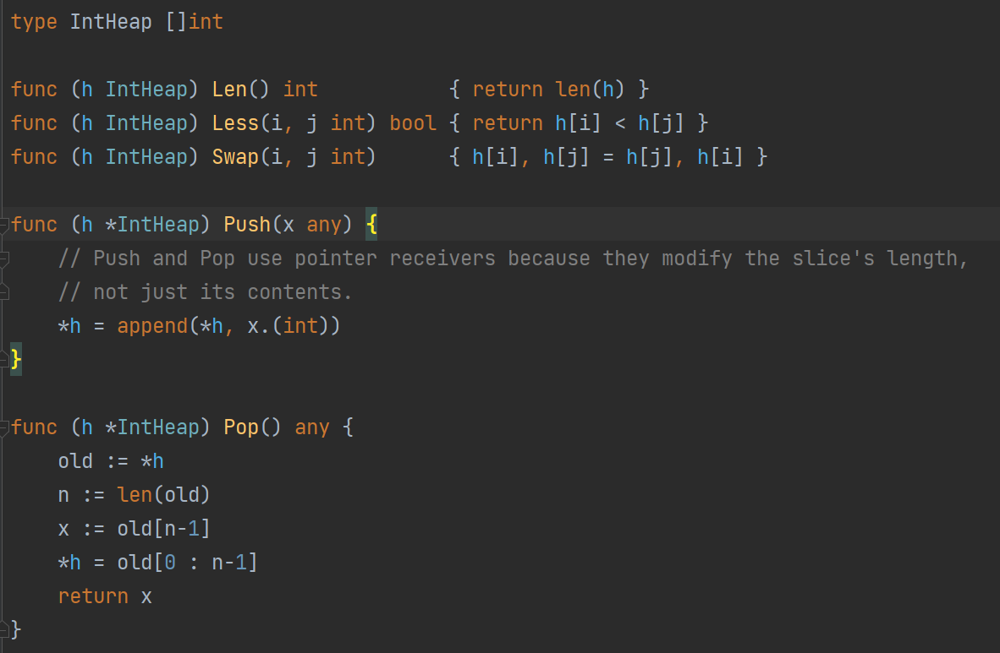
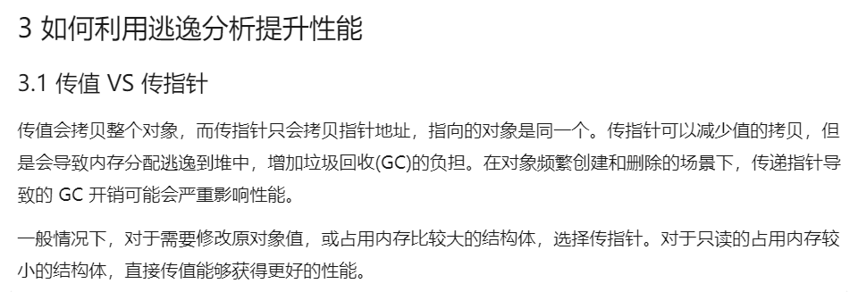
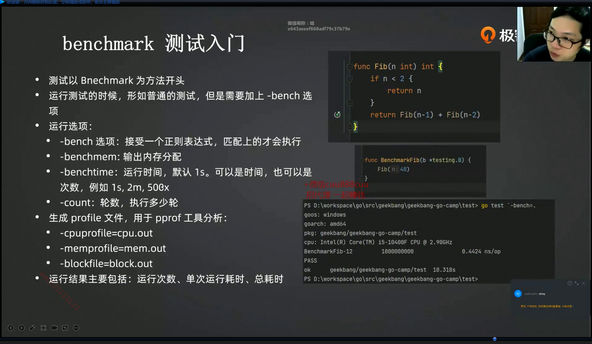
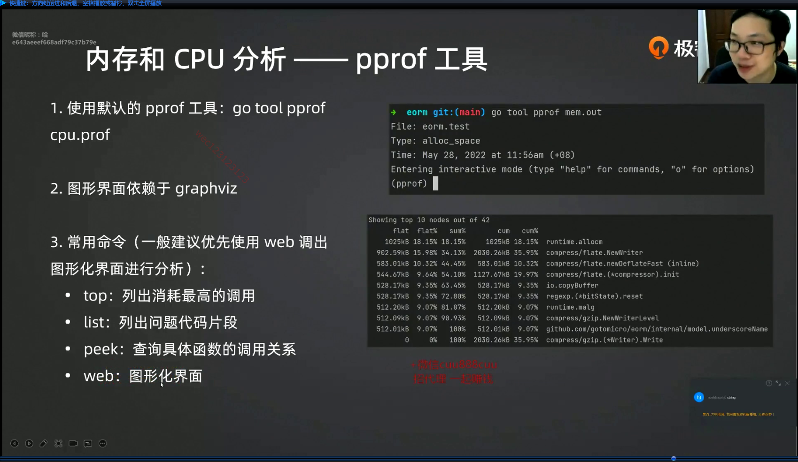

## 使用

### 镜像下载地址

[网址](http://idea.ismicool.cn/jetbrains/?csdn)

### Goland破解

[网址](https://baijiahao.baidu.com/s?id=1696890025107786507&wfr=spider&for=pc)

### 环境配置

[网址](https://blog.csdn.net/lakersssss24/article/details/108649181)

### Go版本管理

[网址](https://blog.csdn.net/weixin_42750434/article/details/121041728)

### Goland激活

[网址](https://www.bilibili.com/read/cv16101792)

[网址2](http://web.52shizhan.cn/ide?k=goland)

### 无效SDK

[网址](https://blog.csdn.net/qq_40943462/article/details/121505084?spm=1001.2101.3001.6650.6&utm_medium=distribute.pc_relevant.none-task-blog-2%7Edefault%7EBlogCommendFromBaidu%7Edefault-6.highlightwordscore&depth_1-utm_source=distribute.pc_relevant.none-task-blog-2%7Edefault%7EBlogCommendFromBaidu%7Edefault-6.highlightwordscorehttps://blog.csdn.net/qq_40943462/article/details/121505084?spm=1001.2101.3001.6650.6&utm_medium=distribute.pc_relevant.none-task-blog-2%7Edefault%7EBlogCommendFromBaidu%7Edefault-6.highlightwordscore&depth_1-utm_source=distribute.pc_relevant.none-task-blog-2%7Edefault%7EBlogCommendFromBaidu%7Edefault-6.highlightwordscore)

### 电子书

[Go并发编程实战](https://link.zhihu.com/?target=https%3A//pan.baidu.com/s/18YOmYXd65ZM1w6nKMhyTpw) 提取码：59m6

[Go语言实战](https://link.zhihu.com/?target=https%3A//pan.baidu.com/s/10SsqtZIZnj8n0EiYr8qHQA) 提取码：dw0z

[学习 Go 语言(Golang)](https://link.zhihu.com/?target=https%3A//pan.baidu.com/s/1ct5IqRjvGSSxDIgLybWZEw) 提取码：86nv

[Go语言圣经](https://link.zhihu.com/?target=https%3A//pan.baidu.com/s/1jRmcwZUgIadxW9mo69SfYQ) 提取码：i4c5

[Go语言程序设计](https://link.zhihu.com/?target=https%3A//pan.baidu.com/s/1KpP2xECPBn6iPVKGdZBEAg) 提取码：kzhd

[Go语言标准库参考](https://link.zhihu.com/?target=https%3A//pan.baidu.com/s/1bJopf9JJNUDB2bc08BgrXw) 提取码：s4j4

[Go语言编程](https://link.zhihu.com/?target=https%3A//pan.baidu.com/s/12Z0v-vjG6Fu9atGMigMknA) 提取码：jzpt

[Go_web_编程](https://link.zhihu.com/?target=https%3A//pan.baidu.com/s/1kzfW8B6D5jzP4pa3IB1YeA) 提取码：3t88


## 语法

### 基础

```go
### Switch 

每句自动 break 若想继续下去 加 fallthrough
fallthrough 会使其强制执行后面的代码

### Range 

迭代打印 会返回两个值 第一个是元素位置 第二个是元素本身 常用于for循环 如 i，date:= range  str（变量）

### break和continue

break 跳出距离最近的循环 可在for和switch里使用

continue 跳过本次循环 只能在for里使用
```


### 输入输出

```
fmt.Scan(&s)

Scan函数会识别空格左右的内容，哪怕换行符存在也不会影响Scan对内容的获取。
Scanln函数会识别空格左右的内容，但是一旦遇到换行符就会立即结束，不论后续还是否存在需要输入的内容。

输入带有空格的字符串
inputReader := bufio.NewReader(os.Stdin)
s, _ := inputReader.ReadString('\n')

文件格式化写入
fmt.Fprintf(w, "g_status: %d\n", len(g10086.G_status))

输出补0
//转4位数字符串，不足前补0
newStr:=fmt.Sprintf("%04d", v) // 若v = 11，结果 0011
```

```
// 输出字段名
%v %+v %#v
```


### 循环

```
range 只会计算一次数组长度，之后数组长度改变，不会影响遍历的次数。
for循环则每次循环都会计算是否达到终止条件，故for循环中改变数组长度会影响循环
```

```
range 是对迭代值的拷贝，故在遍历[]int这些类型时，内存占用小，性能与for一致
而range迭代结构体指针数组时，由于指针内存较小，故性能和for一致
只有迭代值是复杂的结构体数组，那么range拷贝的时间和空间都变大，性能影响显著。可改用for遍历。
```


### 字节

单字节乘数字相对于ASCII码乘数字

```
fmt.Println('9' * 6) // 342
fmt.Println(('9'-'0') * 6) // 54
```


### 字符串

```
字符串是不可变的，因此无法分配字符给字符串。需要把字符串转化为[]byte处理完后，再string([]byte)
```

```
官方推荐Buider来拼接字符串性能最优。使用+拼接，则会申请一片新的空间，空间大小为两字符串长度之和，更
消耗内存。而Buider和Buffer底层通过[]byte实现，返回时转化为string即可，空间上每次申请内存额度翻倍，
如此能减少申请空间次数，减少内存消耗
```

```
string底层是[]byte，统一使用utf8编码，因此英文占一个字符，中文占三个字符。故要打印单个中文，通过
str[0]下标打印只能打印出单个字节而已，正确处理方式为 string 转为 rune 数组
```


#### strings.Contains(被检查字符串，检查字符串)

返回值是bool类型，查找一个字符串在另一个字符串中是否出现

#### strings.index(被检查字符串，检查字符串)

返回值是int类型，查找一个字符串在另一个字符串中的位置下标，-1表示找不到，0表示第一个位置

#### strings.join(字符串切片，连接符)

返回值是字符串，用于字符串的连接，连接在每两个切片元素之间

#### strings.Split(string,分割点字符)

将字符串成切片，返回值是切片，故可以取其下标，打印某个位置字符

#### strings.repeat(string，int（重复次数）)

返回值是string类型，重复输出字符串

#### strings.replace(string,原词，替换词，替换个数)

替换内容，可用于屏蔽敏感词。当个数小于零时，即全部原词部分替换

#### strings.trim(string,去掉的字符)

去掉字符串头尾的内容，用于整理字符串

#### strings.field(string)

用于去掉字符串中的空格，转成切片，可用for循环来统计单词个数

#### Strconv.formatint(int,进制)

将数字转换不同进制


### 数组

```
对两个数组拷贝可以用copy(s,s1)即可

Map函数  m:=map[int]string{1:"张山",2:"王五",3:"李四"}

动态定义数组，要用切片实现
var array = new([elems]int) - no, arrays are not dynamic 
var slice = make([]int,elems) // or slice := make([]int, elems) 
```

初始化数组

```
balance := [5]float32{1000.0, 2.0, 3.4, 7.0, 50.0}
var balance = [5]float32{1000.0, 2.0, 3.4, 7.0, 50.0}
```

遍历数组

```
arr.Range(function(k,v)bool{
	fmt.Println(k,v)
	return true
})
// 期间有返回false则暂停遍历
```

```
sort.slice 数组排序
sort.Slice(arrs, func(i, j int) bool {
    return arrs[i].Num > arrs[j].Num
})
```

自动计算长度

```
a := [...]int{1, 2, 3} // ... 会自动计算数组长度
```

数组和切片拷贝区别

```
固定长度的数组，赋值一个新变量，是从源数组拷贝一份过去，新变量有独立的内存空间
切片拷贝是会复用源切片的底层数组，使用的是同一内存空间，要深度拷贝完全隔离得用copy
```


### 对象

```go
// 定义
var menu=make(map[int]string)

// tmp为值，ok为键
tmp,ok:=menu[v.Parent]
```

```
map不允许同时读写，需要在进程中上锁和解锁lock.Lock() lock.Unlock( )
```

```
delete(g10086.G_status, key) // 删除对象属性
```

```
遍历对象是随机遍历的,要想按顺序输出map,可以用一个切片获取所有的key值后排序，然后遍历切片顺序输出map

keys := []string{}
for key, _ := range mp {
    keys = append(keys, key)
}
sort.Strings(keys)
for _, key := range keys {
    fmt.Println(key, " ----> ", mp[key])
}
```

```
map[int]struct{} 比 map[int]bool 更省空间，因为定义空结构体是不占用空间的，对于单单使用键的操作，
节省资源更优
```


### 结构体

#### 结构体数组初始化

```go
// 结构体数组或切片书写格式，注意若是结构体则每个元素前要表明结构体数据类型
var s [3]student=[3]student{
student{"a",18,"男"},
student{"b",19,"女"},
student{"v",12,"女"}}
```

#### 遍历结构体并添加分类数据

```go
tmp:=make(map[string]interface{})
key:=reflect.TypeOf(*v)
val:=reflect.ValueOf(*v)
length:=key.NumField()
for i:=0;i<length;i++{
    tmp[key.Field(i).Name]=val.Field(i).Interface()
}
tmp["Category"]=cate[v.Parent]
data=append(data,tmp)[映射](https://www.cnblogs.com/liweijiee/p/13879163.html)
```

[通过reflect反射修改值1](https://blog.csdn.net/lanyang123456/article/details/95238197)

[通过reflect反射修改值2](https://www.wenjiangs.com/doc/7snvoxgy)

#### 匿名字段

```
结构体若继承的结构体为匿名字段，则可以直接调用子结构体内的字段，否则要多写子结构体名
如调用Son里的name字段：
匿名：Parent.name   
不匿名：Parent.Son.name
```


#### 遍历结构体并修改

```go
// 遍历更改空字段
key := reflect.TypeOf(t)
val:=reflect.ValueOf(&t)
v := val.Elem()
oldVal := reflect.ValueOf(target)
for i := 0; i < key.NumField(); i++ {
    v.Field(i).Set(oldVal.Field(i))
}
```


#### 结构体tag

```go
type Student3 struct {
	Name  string `json:"-"`                 // json编码中，这个字段不参与
	Age   int    `json:"realAge,omitempty"` // 字段编码成realAge,为空则不编码
	Score int    `json:"score,string"`      // 编码时修改字段名和类型
}
```


#### 判断结构体是否相等

```
reflect.DeepEqual(s1, s2)
```


### 指针

```go
a:=[4] int{1,3,35}
var p *[4]int //是一个数组指针，专门指向数组，
p=&a    //但要求数组内存与数组指针大小一致
var p [3]*[3]int=[3]*[3]int{&a,&b,&c} //数组的指针数组，即数组里存放的元素都是指针数组
```

```go
make([]*MenuTree,0) // 定义一个长度为零，指针MenuTree类型的数组
```

```go
//结构体的指针初始化
https://www.cnblogs.com/tianyajuanke/p/5234205.html

//第1种方式，使用 new 关键字
player4 := new(Player)
player4.userid = 4
player4.username = "lina4"
player4.password = "123456"

//第2种方式，声明同时初始化
player5 := &Player{5, "lina2", "123456"}

//第3种方式，通过 field:value 形式初始化，该方式可以灵活初始化字段的顺序
player6 := &Player{username: "lina3", password: "123456", userid: 6}
```


### 切片

#### 概述：可看作不需要指定长度的数组

```
切片的本质是一个结构体，包含一个指向底层数组的指针(prt)，长度（len），容量（cap）。
所以，切片本身包含一个指针，将切片按值传递给函数，在函数内对其修改，影响将会传递到函数外。
因为底层的数组被修改了。
```


```

- 函数形参(arr...)可调用全部参数  若为 arr[0:4] ... 
  即从第一个元素到第三个元素 不包含第四个  若为 arr[0:5] 则包含第四个

- 切片容量在1024前都是以两倍扩容

	切片的截取:  s:=slice[low:high:max]

	若全部截取:  s:=slice

	截取后的切片与原切片地址一样，修改截取后的切片会同时修改原切片内容

- 切片与指针的联系，切片内存的是地址，没有下标，因此指针需先*取值后才能写下标进行修改

- 切片数据是放在堆区的

	
```

```
切片容量和长度：
如果底层结构的数组容量足够，改变 slice 的 len 即可，slice 地址不会改。
如果底层结构的数组容量不够，Go 会自动帮助创建新的数组，并将 s 指向新创建的数组，
即s指向的数组地址改变了，而slice 本身的地址并没有改变，只是改变了地址中的内容。
https://www.zhihu.com/question/59659980

slice 都是引用原数组的原地操作, 为避免引起的副作用, 需要拷贝数组:
var dest = make([]int, len(src))
copy(dest, src)
https://segmentfault.com/q/1010000020323947
```

```go
二维切片
// 方法0
row, column := 3, 4
var answer [][]int
for i := 0; i < row; i++ {
    inline := make([]int, column)
    answer = append(answer, inline)
}
fmt.Println(answer)

// 方法1
answer1 := make([][]int, row)
for i := range answer1 {
    answer1[i] = make([]int, column)
}
```

```
// 指针切片用法
(*arr)[k]
```


#### make

https://www.cnblogs.com/xiaxiaosheng/p/11167326.html

```
make([]int, 2)返回的是一个长度为2的slice
```

#### 合并切片

```go
slice = append(slice, anotherSlice...)
```

#### 切片初始化

```
var stack=[]int{1}
```


#### 返回空切片

```go
if head==nil{return []int{}}
```


#### nil切片

```
通过var a [ ]int创建的切片是一个nil切片
通过b:=make([]int,0)创建的是一个空切片，（底层数组为空，但底层数组指针非空）
```


#### append注意

```
arr=append(arr,val) // 添加单个值
当arr的len==cap时，append会通过make创建一个更大容量的切片，然后复制arr并添加val进去 
当arr的len<cap时，append会将val的地址添加到arr中，即修改val的地址内容，arr也会对应修改。故有坑

arr=append(arr,arr1) // 添加切片
当添加切片时要注意，由于arr拼接的是arr1的地址，如果arr1改变的话，arr也会改变
解决方法：
1 复制arr1
tmp=make([]int,len(arr1))
arr=append(arr,tmp)
2 使用新的切片
arr=append(arr,append([]int(nil),arr1...)) // 看起来更高级
```


### heap

使用样例


必须自定义一个结构体和五个方法，Less可看作出队的逻辑，此处按从小大大出队




### 文件

Fp.write(字符串切片，int 位置)指定位置输入

Os.open()只是以只读的方式打开文件，os.openfile()则可以选择多种模式

```
// os.OpenFile 是一个更为通用的函数,它需要三个参数,
   // 1. 文件路径
   // 2. 指定选项,以下选项可组合使用
      //O_RDONLY int = syscall.O_RDONLY // 以只读方式打开文件
      //O_WRONLY int = syscall.O_WRONLY // 以只写方式打开文件
      //O_RDWR   int = syscall.O_RDWR   // 以读写模式打开文件
      //O_APPEND int = syscall.O_APPEND // 以写操作时将内容追加到文件末尾
      //O_CREATE int = syscall.O_CREAT  // 如果文件不存在,则创建新的文件
      //O_EXCL   int = syscall.O_EXCL   // 和O_CREATE 一起使用,文件必须不存在
      //O_SYNC   int = syscall.O_SYNC   // 打开文件以同步I/O
      //O_TRUNC  int = syscall.O_TRUNC  // 如果可能,打开文件时清空文件
```

``` 
bufio.Writer //将数据直接写到os打开的文件中
```

```
Writer.flush() // 清空缓冲区，写入文件
```

```
os.Stdout //指向系统的标准输出
```

```
json.NewDecoder用于http连接与socket连接的读取与写入，或者文件读取
```


### 标签

```go
LABEL1:
	for i := 0; i < 5; i++ {
		for j := 0; j < 5; j++ {
			if j == 3 {
				continue LABEL1 // 会保留i状态
				//break LABEL1    // 直接结束
				//goto LABEL1     // 清空i状态
			}
			fmt.Println("i:", i, ",j:", j)
		}
	}
	fmt.Println("over")
```


### 枚举

```
使用const+iota实现
```


### 多态

```
当不同类有相同的方法名但内部效果不同时，则可以用多态接口interface{}来定义公共函数。
只要传入不同类的指针，就能调用对应的方法名，如：

package main
import "fmt"

type Student2 struct {
	name string
	responsibility string
}
type Teacher2 struct {
	name string
	responsibility string
}
type SelfResponse interface {
	response()
}

func (s *Student2) response()  {
	fmt.Println(s.name,"的责任是：",s.responsibility)
}
func (t *Teacher2) response()  {
	fmt.Println(t.name,"的责任是：",t.responsibility)
}
func selfResponse(r SelfResponse)  {
	r.response()
}
func main(){
	s:=Student2{name: "小米",responsibility: "学习"}
	t:=Teacher2{name: "老朱",responsibility: "育人"}
	selfResponse(&s)
	selfResponse(&t)
}
```


### 泛型

[使用1](https://blog.csdn.net/weixin_46040684/article/details/122009114)

[使用2](https://blog.csdn.net/kevin_tech/article/details/120620435)

[1.17教程](https://www.bilibili.com/video/BV1ky4y1V7tJ?from=search&seid=18309296363534508591&spm_id_from=333.337.0.0)

[1.18补充](https://blog.csdn.net/EDDYCJY/article/details/121528615)

```
$ go1.17 run -gcflags=-G=3(要带上这个) generics.go 
```

```
// 基本使用
package main

import "fmt"

func compare[T int | string](a,b T) T {
	if a>b{
		return a
	}
	return b
}

func main(){
	fmt.Println(compare[int](12,3)) // 匿名写法compare(12,3)
	fmt.Println(compare[string]("abc","Abc"))
}
```

```
// 泛型map使用及泛型约束

type MyType interface {
	int|string|bool
}

type myMap[K MyType,V any] map[K]V

MyMap:=make(myMap[string,int])
MyMap["abc"]=123
fmt.Println(MyMap)
```


### 时间

[time.NewTicker计时器](https://www.cnblogs.com/hello-/articles/15578391.html)

[时间戳转化时间](https://wenku.baidu.com/view/b1ca0a01be64783e0912a21614791711cc7979c1.html)

```
time.NewTicker

NewTicker 返回一个新的 Ticker。

ticker.C:
该 Ticker 包含一个通道字段，并会每隔时间段 d 就向该通道发送当时的时间。
向其自身的 C 字段发送当时的时间。
它会调整时间间隔或者丢弃 tick 信息以适应反应慢的接收者。
如果d <= 0会触发panic。关闭该 Ticker 可以释放相关资源。
```

```
<-time.After(10 * time.Second)
```

```
time.Now().Sub(t) // 计算现在时间与t时间差
```

```
int转化为time.Duration类型
time.Duration(num)
```

计算两个时间的差值

```
// 当前时间与time1时间差
time1:=time.Now()
time.Since(time1).Seconds()
```


### 日志

```
log.Fatal(err)
打印输出内容
退出应用程序
defer函数不会执行
```

```
SetOutPut可以用于设置日志输出的地方，比如终端，文件等。
```

```
// 初始化日志
var logger *log.Logger
func initLog() {
	f, _ := os.Create("/var/log/lottery_demo.log")
	logger = log.New(f, "", log.Ldate|log.Lmicroseconds) // 日志前缀日期加上时间
}
```


### http

```go
// post请求及参数
resp, err := http.PostForm("http://127.0.0.1:8088/httpTest",
url.Values{"key": {key}, "val": {val}})
```


### 位运算

```
取反 ^
```


### 其他

```
new函数相当于c语言的malloc函数，但不用释放内存
```

```
多重继承要按顺序赋值
子类可以继承父类的属性和方法，而父类不可继承子类
```

```
//TODO 标记 方便查找
```

```
获取命令行参数
命令行：go run client.go counterA 6
client.go中获取：key, val := os.Args[1], os.Args[2] // key:counterA,val:6
```


## 知识点

### nil

nil的意思是无，或者是零值。零值，zero value，是不是有点熟悉？在Go语言中，如果你声明了一个变量但是没有对它进行赋值操作，那么这个变量就会有一个类型的默认零值。这是每种类型对应的零值：

```go
bool      -> false                              
numbers -> 0                                 
string    -> ""      

pointers -> nil
slices -> nil
maps -> nil
channels -> nil
functions -> nil
interfaces -> nil
```


### 包

```
每个包在import时会自动执行init()函数，该函数没有返回值，不能被调用
```

```
包的特性如下：
一个目录下的同级文件归属一个包，且只有一个包。
包名可以与其目录不同名。
包名为 main 的包为应用程序的入口包，编译源码没有 main 包时，将无法编译输出可执行的文件，
即主入口函数名要与包名一致
```

```
调用同名包下的函数：
主入口必须只能下载一个文件中
要编译文件后，其他文件才能调用该文件函数，故要配置为软件包
```

```
封装包并调用：
https://blog.csdn.net/u012925833/article/details/100772257

使用自定义包：
https://www.cnblogs.com/ficow/p/6537363.html
```

```
导入本地包：
https://zhuanlan.zhihu.com/p/109828249

当前包目录下创建go.mod，写入

module 包名
go 1.15 // go版本

然后重启，即可调用当前目录下的包
```

```
要运行一个包，可以go build会在当前目录下生成可执行文件，主入口main
```

```
不同目录下导入包
1 两个包都要有go.mod
2 在要使用其他包的go.mod下添加
require "mypackage" v0.0.0
replace "mypackage" => "../mypackage"


同级目录下使用包,可以不使用mod,如
main.go
pakeage/utils.go
只需在main中import pakeage


同一顶层目录，直接按路径导入
go.mod：
moudle Parent

parent/dir1/dir2的main.go要使用parent/other1/other2这个包：
import Parent/other1/other2 即可
```


### 锁

```
"锁" 在线程同步的时候是非常重要的, 如果是文件锁能够防止误写, 当然锁的用法也比较简单, 
操作前 加锁, 操作完成 解锁, 当有其他线程操作的时候, 需要等待, 直到其他线程解锁, 方能继续操作.
可以配合defer进行写锁和解锁操作
```

[sync.Map详解](https://zhuanlan.zhihu.com/p/344834329)


### ... 用法

```
它的第一个用法主要是用于函数有多个不定参数的情况，可以接受多个不确定数量的参数。
第二个用法是slice可以被打散进行传递。
```

[网址](https://blog.csdn.net/jeffrey11223/article/details/79166724)


### 管道并发

```
人可以同时听歌、看小说、聊天就是一个并发过程
即不同进程同时交错执行
```

```
提前退出go进程 runtime.GOEXIT
```

```
管道 numChan:=make(chan int)
写入 numChan<-i
读取 data:=<-numChanz
```

```
管道不make分配空间，默认是nil，读写都会堵塞
管道写入满后，写入操作会堵塞
管道读取完后，读入操作会堵塞

为解决读写次数不对等导致程序崩溃问题，可以在写入完后close(numChan)
然后读取时用for v:=range numChan 遍历
```

```
判断管道是否关闭 v,ok:=<-numChan 然后判断ok,!ok 为管道已关闭
```

```
单向管道，只读或只写的管道，定义如下
var readOnly <-chan int
var writeOnly chan int<-
```

```
监听多个管道的读写进程时，可以用select 避免使用的管道混淆
```

```
问题：如何提高性能
分析：要提高性能，可以将大量改写的程序放入后台服务完成，使主进程接收结果即可。
解决：创建一个callback管道，放入后台监听，当有需要改写，则将构造服务队列，
任务传入管道。后台一直监听随时改写
```

#### 管道有无缓冲区区别

``` 
ch1 := make(chan bool) // 无缓冲
ch2 := make(chan bool, 1) // 有缓冲

无缓冲的管道是同步的，即传入值一定要有接收者使用才不会堵塞
有缓存的管道是异步的，可以暂时缓存传入值，只有当缓冲区满时才会堵塞

由于无缓冲的管道的同步性，当主程序退出导致没有管道的接收者时，容易造成协程的无法退出。耗费内存空间，
一般一个协程为2k大小。使用有缓存的管道即可解决
```

```go
// 代码测试
func TestChannel(t *testing.T) {
	ch := make(chan int, 0)
	ch1 := make(chan int, 1)

	go func() {
        // 用个协程来准备无缓冲管道的接收者
		num := <-ch
		fmt.Println(num)
	}()

	ch1 <- 1
	fmt.Println(len(ch1), cap(ch1))
	ch <- 1 // 发送者
    
    // 以下方式会堵塞，没有同时准备接收者和发送者
    // ch <- 1
    // num := <- ch

	for {
		select {}
	}
}
```


#### 优雅的关闭通道

```
通道一直不关闭，子协程若有for select 就会一直循环不退出，浪费内存空间

情形一：M个接收者和一个发送者，发送者通过关闭用来传输数据的通道来传递发送结束信号。
情形二：一个接收者和N个发送者，此唯一接收者通过关闭一个额外的信号通道来通知发送者不要再发送数据了。
情形三：M个接收者和N个发送者，它们中的任何协程都可以让一个中间调解协程帮忙发出停止数据传送的信号
```


### 不定参

 可写任意数量的参数  不定参数必须放在固定参数后面 可以不写入

 格式：  func run(agrs ... int)  //参数名  ... type

 相当于一个集合 可以用函数len(agrs)来计算集合个数


### 匿名变量

作用:丢弃数据


### 随机数

rand.Seed(time.Now().UnixNano())  //创建随机生产数种子

如 v:=rand.Intn(4) 随机数0到3

```
// 由时间戳生成随机数
seed := time.Now().Unix()
index := rand.New(rand.NewSource(seed)).Int31n(int32(count))
```


### 逃逸分析

```
interface{},指针在函数结束时不会释放，而是分配到堆中动态管理，即内存逃逸了
若是栈空间（较小，一般64KB）不足，则会栈溢出，对象占用的内存会分配到堆上
```




### 延迟defer

延迟调用 defer

Recover()函数在defer函数中使用,作用防止程序崩溃

多个defer执行顺序遵从先入后出的栈原理

defer、return、返回值三者的执行逻辑应该是：return最先执行，return负责将结果写入返回值中；接着defer开始执行一些收尾工作；最后函数携带当前返回值退出。

defer 是同步的，必须执行完整个函数才会退出


### context

```
每个Goroutine在执行之前，都要先知道程序当前的执行状态，
通常将这些执行状态封装在一个Context变量中，传递给要执行的Goroutine中。
类似一个全局变量分配给函数链

context包不仅实现了在程序单元之间共享状态变量的方法，同时能通过简单的方法，
使我们在被调用程序单元的外部，通过设置ctx变量值，将过期或撤销这些信号传递给被调用的程序单元。
在网络编程中，若存在A调用B的API, B再调用C的API，若A调用B取消，那也要取消B调用C，
通过在A,B,C的API调用之间传递Context，以及判断其状态，就能解决此问题，
这是为什么gRPC的接口中带上ctx context.Context参数的原因之一。
```

[网址](https://www.cnblogs.com/zhangboyu/p/7456606.html)


### bufio

[网址](https://www.jianshu.com/p/04aebd42b762?u_atoken=00c85f6d-b73d-4e96-80e8-bf9003f5a07a&u_asession=010jq2gyIjOwhRh23K3aoNZ6u-M4KAAvYz36SSvqD7zpxOEnDazrolri2_Owa9F7yPX0KNBwm7Lovlpxjd_P_q4JsKWYrT3W_NKPr8w6oU7K94FS5zDk7vlTZkc34YnIWf3TYvls7v_Epik-OyKXq1TWBkFo3NEHBv0PZUm6pbxQU&u_asig=05G8KSPN3M7NzycV7ubsMhT5mtpSnLF2v_czPOPR-OhiaQbWHLBntq8X3jPypq_d-htHNA-WA84AjIgvUxwbui5vCEC--cjo2odaf83BaQVNevy_1La2bK7gFC5pmqjFNYJpp2jaAS3r8aNZFl0X6Ud3mQo4kfGa8MDYpZ8Yh5EeX9JS7q8ZD7Xtz2Ly-b0kmuyAKRFSVJkkdwVUnyHAIJzaS2mKO0VQ--yfUNfB2lh47CfY54TAJXiuwfWT87RxLAyZo170oZzfjmGNwwqqFezu3h9VXwMyh6PgyDIVSG1W-SnPV5Zz1soZltJ4abn6zxMcP86Dpk-9o5WW2hT6bxqgldwr8k9PQtGgyN0c0TJQNlharQ7j3beha1XIQAfvnCmWspDxyAEEo4kbsryBKb9Q&u_aref=17UnmKE5bLb2vFBJKHA800KSLaM%3D)

```
带有缓存区的io读写操作，效率更高
```


### unsafe

```
unsafe.Pointer和uintptr都是指针
但unsafe.Pointer在GC时会被维护，一旦对象地址改变，GC会修正unsafe.Pointer地址
而uintptr只是储存了地址，不会被GC修正
```


### interface{} (重要)

https://www.cnblogs.com/mafeng/p/6208014.html

```
var _ Person = (*Student)(nil)
var _ Person = (*Worker)(nil)
```

- 将空值 nil 转换为 *Student 类型，再转换为 Person 接口，如果转换失败，说明 Student 并没有实现 Person 接口的所有方法。
- Worker 同上。
- [网址](https://geektutu.com/post/quick-golang.html#6-%E7%BB%93%E6%9E%84%E4%BD%93%EF%BC%8C%E6%96%B9%E6%B3%95%E5%92%8C%E6%8E%A5%E5%8F%A3)


### 单双引号区别

```
双引号是用来表示字符串string，其实质是一个byte类型的数组，单引号表示rune类型。
所以单引号才能相减求ASKII；双引号当作字符串，相加即合并字符串
```


### 协程和管道讲解

[网址](https://studygolang.com/articles/33340)


### 函数名大小写作用

```
小写函数名它的作用域只有当前包，不能被其他包使用，
如果我们把函数名以大写开头，可以被其他包调用，这也是 Go 中大小写的作用
```

### Go中函数和方法的区别

https://www.cnblogs.com/leeyongbard/p/10369621.html

```
函数无需继承某对象，输入参数甚至无需参数即可使用；而方法要继承对象，可以使用对象中的特性
```

### 面向过程和面向对象（重点）

https://www.zhihu.com/question/27468564/answer/757537214

```
面向过程能快速迭代，短时间内效率高。
面向对象更优，具有可维护性，复用性，扩展性，灵活性
```


### 内存相关

```go
//获取内存
unsafe.Sizeof(arr)

var arr=new([]int)
var arr1 []int
fmt.Println(unsafe.Sizeof(arr),unsafe.Sizeof(arr1)) // 结果 8 24
// 因为new是返回一个指针
```


### 内存与字节数

```
uint8 常用byte类型 无符号8位整形 内存8比特即1字节 范围0-255
uint16,int64此类类比uint8
```


### make和new区别

https://www.jb51.net/article/56837.htm

### func函数详解

https://blog.csdn.net/weixin_39345003/article/details/109295173

#### error返回错误信息

https://blog.csdn.net/TCatTime/article/details/110343132

```
errors.New()函数返回一个error类型。
```


### 数据结构

#### 栈

```
可顺序栈（单指针）或链式栈（可单双指针）
定义节点 出入栈函数 打印函数 判断空栈满栈（可选）
```


#### 队列

```
可顺序队列或链式队列（都为双指针）
定义节点 出入队列函数 打印函数 判断空队列满队列（可选）
```


#### 树

https://zhuanlan.zhihu.com/p/110937962

```
定义节点 创建节点函数 遍历树函数 查找节点 求树高度（可选）

复制树：申请新空间，不能在原树上操作
https://blog.csdn.net/qq_36183935/article/details/80257891

树的使用，多种方法遍历树
D:\GOPATH\src\Leetcode\数据结构\27二叉树使用.go
```

先序加中序确定一棵树

https://blog.csdn.net/m0_37149062/article/details/105141485


### Leetcode

#### 动态规划

19. [正则表达式匹配](https://leetcode-cn.com/leetbook/read/illustration-of-algorithm/9a1ypc/)

```
状态定义： 设动态规划矩阵 dp ， dp[i][j] 代表字符串 s 的前 i 个字符和 p 的前 j 个字符能否匹配。

转移方程:  需要注意，由于 dp[0][0] 代表的是空字符的状态， 
		  因此 dp[i][j] 对应的添加字符是 s[i - 1] 和 p[j - 1] 。
          当 p[j - 1] = '*' 时， dp[i][j] 在当以下任一情况为 truetrue 时等于 truetrue ：

dp[i][j - 2]： 即将字符组合 p[j - 2] * 看作出现 0 次时，能否匹配；
dp[i - 1][j] 且 s[i - 1] = p[j - 2]: 即让字符 p[j - 2] 多出现 1 次时，能否匹配；
dp[i - 1][j] 且 p[j - 2] = '.': 即让字符 '.' 多出现 1 次时，能否匹配；
当 p[j - 1] != '*' 时， dp[i][j] 在当以下任一情况为 truetrue 时等于 truetrue ：

dp[i - 1][j - 1] 且 s[i - 1] = p[j - 1]： 即让字符 p[j - 1] 多出现一次时，能否匹配；
dp[i - 1][j - 1] 且 p[j - 1] = '.'： 即将字符 . 看作字符 s[i - 1] 时，能否匹配；
初始化： 需要先初始化 dp 矩阵首行，以避免状态转移时索引越界。

dp[0][0] = true： 代表两个空字符串能够匹配。
dp[0][j] = dp[0][j - 2] 且 p[j - 1] = '*'： 
首行 s 为空字符串，因此当 p 的偶数位为 * 时才能够匹配（即让 p 的奇数位出现 0 次，保持 p 是空字符串）。因此，循环遍历字符串 p ，步长为 2（即只看偶数位）。
返回值： dp 矩阵右下角字符，代表字符串 s 和 p 能否匹配

```


### 接收命令行参数

```
os.Args // 返回命令行的字符串切片
```


### go env 配置环境变量

```
go env -w GO111MODULE=on

export GO111MODULE=on // linux下
```


### go mod 版本管理工具

[网址](https://blog.csdn.net/qq_31362439/article/details/103981542?spm=1001.2101.3001.6650.1&utm_medium=distribute.pc_relevant.none-task-blog-2%7Edefault%7ECTRLIST%7Edefault-1.no_search_link&depth_1-utm_source=distribute.pc_relevant.none-task-blog-2%7Edefault%7ECTRLIST%7Edefault-1.no_search_link&utm_relevant_index=2)

```
go mod init // 初始化包
go mod tidy // 拉取最新版本，移除不用的包
go help mod // 查找帮助
```


### go get 安装位置

```
本人在GOPATH/pkg/mod目录下
```


### go install及go build

[网址](https://www.jianshu.com/p/3db831d9b553)

```
// 打包为二进制文件
go build -o hello ./main.go
```


### go test

[Golang 单元测试、基准测试、并发基准测试](https://www.cnblogs.com/linguoguo/p/10371253.html)

```
函数要用Test开头，优先进入TestMain，参数必须带t testing.T之类。
测试benchmark一般会跑n次
命令go test -v(加此参数打印具体过程)
```

go test缓存问题

```
go test有缓存，若未改动代码，结果会和上次一样。
就会出现，若redis缓存变动，但测试结果仍不变。

在测试命令中加上--count=1即可，如
go test -v --count=1 -run TestGame .
```


### benchmark测试

[网址](https://www.cnblogs.com/yahuian/p/14461152.html)

```
b.N 执行次数
无数次循环测试函数的执行时间，直到每次函数执行的时间都稳定下后停止
```

```
// 运行
go test -bench="." -benchmem
```




### pprof工具




### sync

#### sync.Map 数据缓存

```
内部用的是互斥锁，能保证并发安全
```

#### sync.Pool 并发池

```
临时变量会储存在堆上，会对GC造成压力
使用sync.Pool可复用对象，及清理长时间未使用对象，减少内存消耗
```

#### sync.Once 

```
package中init函数在初始化时被加载，若之后init里的变量未使用，会增加执行时间和内存消耗。
且用户每次访问都会init一次，重复计算。使用sync.Once可在使用时再执行，且有并发安全，重复调用
只会加载一次
```

#### sync.Cond

```
当有一个发送者，多个订阅者的情况，则可以使用sync.Cond用来协调和通知订阅者
若使用channel和锁只能一个发送者对应一个订阅者，除非定义多个channel和锁。
```


### for-select中的break、continue和return

[网址](https://blog.csdn.net/u011417820/article/details/103613993)

```
break只能跳出select，无法终止for，要用return
```


### atomic

[网址](https://studygolang.com/articles/3557)

```
atomic是最轻量级的锁,在一些场景下直接使用atomic包还是很有效的。
用原子操作来替换mutex锁
其主要原因是，原子操作由底层硬件支持，而锁则由操作系统提供的API实现。
若实现相同的功能，前者通常会更有效率。
```


### 错误处理机制

handle check

```
func CopyFile(src, dst string) error {
    handle err {
		return fmt.Errorf("copy %s %s: %v", src, dst, err)
	}
	r := check os.Open(src)
	defer r.Close()

	w := check os.Create(dst)
	check io.Copy(w, r)
	check w.Close()
}
```


### 函数为何要传切片指针

[网址](https://zhuanlan.zhihu.com/p/315386899)

```
切片传入函数中，函数会拷贝一份切片的结构，而由于切片存的是数组指针，因此改变切片的元素，外部切片也会改变。
但是函数中如果有append,copy等扩容操作，那么拷贝的切片就会指向新的数组地址，这样子拷贝切片就会和外部
切片彻底断开联系。
所以函数中有扩容操作时要记得传入切片指针合适。
```


## 功能 

### 数据类型别名： 

type abc int 即把int名称改为abc 使用时两个名称都可以用

### 常用格式转换

https://blog.csdn.net/guyan0319/article/details/84450049

```go
#string到int 
int,err:=strconv.Atoi(string) 
#string到int64 
int64, err := strconv.ParseInt(string, 10, 64) 
#int到string 
string:=strconv.Itoa(int) 
#int64到string 
string:=strconv.FormatInt(int64,10)

#error转字符串
msg:=err.Error()

#Type类型转字符串
reflect.TypeOf(obj).String()

#字节转化为字符串
string(buf)

#字符串转化为字节
[]byte(str)

# 将切片转化为字符串
res := strings.Join(userInfos,"")
```

### 修改字符串内容

https://blog.csdn.net/qq_39477410/article/details/84565616

```
先转化为字节切片，才能用数组格式修改
```

### 求字符ASKII码

```go
// 不可用双引号
s:='a'-'A'
fmt.Println(s)
```

### 任何值都能返回字符串

```go
// 输出节点 fmt.Sprintf 返回格式化的字符串
func (n *GNode) string() string {
	return fmt.Sprintf("%v",n.Val)
}
```

### 判空

https://blog.csdn.net/u010670796/article/details/114872453

```
int a==0
string len(a)==0

// 判断map的key是否存在,用ok判断，否则不存在默认为0
val,ok:=map[key]
```

### 跨平台编译

通过go env查看


### 开发计数器模块

[http模块实现个状态计数器](https://blog.csdn.net/PJubuntu/article/details/84465461)

[简单计数器](https://blog.csdn.net/weixin_43895671/article/details/106708676)

[知乎](https://zhuanlan.zhihu.com/p/130354921)

[实现安全计数的若干种方法](https://blog.csdn.net/asd1126163471/article/details/119122198?utm_medium=distribute.pc_relevant.none-task-blog-2~default~baidujs_baidulandingword~default-0.pc_relevant_default&spm=1001.2101.3001.4242.1&utm_relevant_index=3)

[实现线程安全的计数器-sync.Mutex](https://beijingngcc.blog.csdn.net/article/details/117522296?spm=1001.2101.3001.6650.2&utm_medium=distribute.pc_relevant.none-task-blog-2%7Edefault%7EBlogCommendFromBaidu%7ERate-2.pc_relevant_default&depth_1-utm_source=distribute.pc_relevant.none-task-blog-2%7Edefault%7EBlogCommendFromBaidu%7ERate-2.pc_relevant_default&utm_relevant_index=5)

[独立模块开发](https://www.jb51.cc/go/187290.html)


### 主线程等待子线程都运行完再退出

[网址](https://www.cnblogs.com/wujf/p/10881944.html)


### 保留两位小数

```
先将 float64 通过Sprintf保留两位小数，再转成 float64
func Decimal(value float64) float64 {
	value, _ = strconv.ParseFloat(fmt.Sprintf("%.2f", value), 64)
	return value
}
```

### 字符串排序

```
// 先转化为字符串切片，在连接
func SortString(w string) string { 
    s := strings.Split(w, "") 
    sort.Strings(s) 
    return strings.Join(s, "") 
} 
```


### 字符串的map如何有序遍历

```
储存时键从字符变为int32整数，dic[v-'a']，遍历即可有序
```


### 判断一个数是否为平方数

```
for i := 1; i <= n; i++ {
    sqrt := math.Sqrt(float64(i))
    if sqrt/math.Ceil(sqrt) == 1 {
        pows = append(pows, i)
    }
}
```


### [调用api接口](https://blog.csdn.net/jxwBlog/article/details/111190517)


### 函数类型和方法结合妙处

定义一个函数类型 F，并且实现接口 A 的方法，然后在这个方法中调用自己。这是 Go 语言中将其他函数（参数返回值定义与 F 一致）转换为接口 A 的常用技巧。

```
// A Getter loads data for a key.
type Getter interface {
	Get(key string) ([]byte, error)
}

// A GetterFunc implements Getter with a function.
type GetterFunc func(key string) ([]byte, error)

// Get implements Getter interface function
func (f GetterFunc) Get(key string) ([]byte, error) {
	return f(key)
}
```


### 终端打印颜色设置

[网址](https://www.cnblogs.com/sweetXiaoma/p/14430278.html)


### 查找源码位置

[网址](https://zhuanlan.zhihu.com/p/337575452)


### 格式化中文不对齐

[网址](https://blog.csdn.net/zhanghaoqwer/article/details/125396780)


## 问题

### 创建文件失败原因

1. 路径不存在 
2. 文件权限 
3. 打开文件达到上限

### 某区域变黄块：

选中，alt+enter,选不再报告此函数


###  Handler crashed with error assignment to entry in nil map

```
原因:未初始化
解决：用make分配空间，cate:=make(map[string]string,0)
```

### 有方法却未解析

```
尝试文件--清除缓存
```

### socket-server  con, err := listen.Accept()指针不合法

```
报错：panic: runtime error: invalid memory address or nil pointer dereference
原因：此次是由于重复连接同一个ip地址，listen, _ := net.Listen("tcp", address)，导致listen为nil，
故调用的accept方法返回的也为空，引起报错
解决：将连接ip地址操作放置for循环外面，只需执行一次即可
```


### 导入包未解析

[网址](https://blog.csdn.net/qq_31362439/article/details/103981542?spm=1001.2101.3001.6650.1&utm_medium=distribute.pc_relevant.none-task-blog-2%7Edefault%7ECTRLIST%7Edefault-1.no_search_link&depth_1-utm_source=distribute.pc_relevant.none-task-blog-2%7Edefault%7ECTRLIST%7Edefault-1.no_search_link&utm_relevant_index=2)

[网址](https://segmentfault.com/q/1010000020603338)

[网址](https://www.pianshen.com/article/26181699692/)

```
若go mod tidy不起作用，那么把mod里相关包删除，github源文件包也删除，在重新引用，然后go mod tidy
或者文件--清除缓存
```


### 无法识别handle函数

```
报错：无法将 'CreateUser' (类型 func(w http.ResponseWriter, r http.Response, p httprouter.Params)) 
用作类型 Handle

解决：要严格遵守参数一致，handle标准格式如下
func(writer http.ResponseWriter, request *http.Request, params httprouter.Params) {}
```


### fatal error: all goroutines are asleep - deadlock!

[网址](https://blog.csdn.net/u011328417/article/details/89473323)


### websocket 跨域连接错误

报错： websocket: request origin not allowed by Upgrader.CheckOrigin

包："github.com/gorilla/websocket"

解决： 在赋值websocket时写下对跨域的处理

```
ws := &websocket.Upgrader{
		CheckOrigin: func(r *http.Request) bool {
			return true
		},
	}
```


## 感悟

```
资源分类原则：
1 只能调用同层级以内的资源，要避免调用上层的一切资源，如方法，类型，常量。除了接口
2 每个包只负责该包要负责的功能，多余的不相干的函数
```

```
增删改查不需要写一个通用模板
1 难以实现
	1 只能结构体得到字符串，而不能通过字符串得到结构体或结构体指针。
	2 orm框架的做法是将结构体每个字段拆解，放入一个通用结构体Direct中。然后通过解析Direct来拼接出创建
	  表的SQL语句，也只能将结构体变字符串而已，并没有实现通过字符串得到结构体或结构体指针。
	3 只能通过泛型加switch来得到结构体，比大量cv省事，但每有新的结构体也需要补充。
    
2 该接口意义不大
	1 该接口只是为了内部开发省事方便，但也容易带来安全隐患，还得考虑某些表的权限问题。
	2 不易于扩展，无法满足某些接口的特殊需求
	3 杀鸡用牛刀，为了以后少些cv这一小小便利，而花费大量功夫，本末倒置
```


## 注意

```
高类型转换为低类型 会丢失精度 数据溢出 符号发生改变

不同级目录下引用，其引用函数名要大写，同级目录下的包声明要一致，不同级要不一致

go中无while语法，可用for和break代替

指针要初始化才能使用，因为单单定义无对应内存大小，可用new来初始化分配内存

go函数可返回多个值，而c只能返回一个值，要么新建结构体返回，要么使用指针

int32和int64当遇前面数字00000时，是以八进制为单位。正常以十进制为单位

json.Mashal 不要序列化指针
```