## 知识

### context

- context实例不可变，每次调用api，都会返回一个新创建的ctx
- 父级ctx控制底下所有子ctx,而子ctx连自己的父亲是谁都不清楚，因此父ctx错误，所有子ctx都错误，而子ctx错误不会影响到父ctx
- 可用于业务超时控制

#### WithTimeout

超时给ctx发送错误

#### context.Err

context的管道没关闭前都返回nil,

关闭后会根据对应情况返回不同的错误

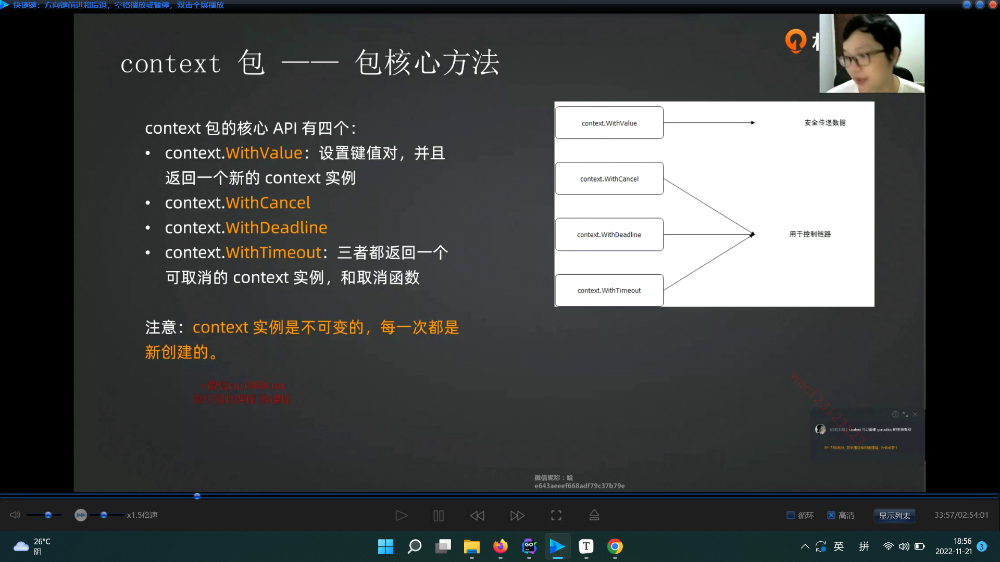

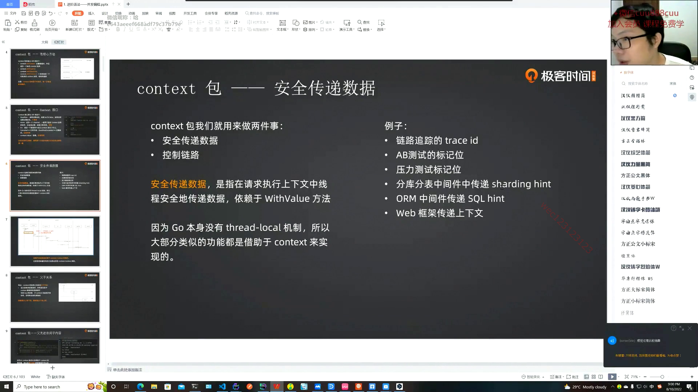

#### 超时控制

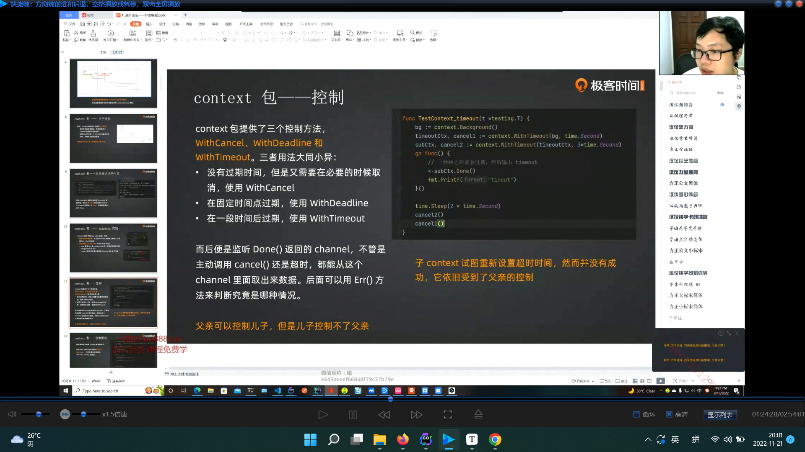

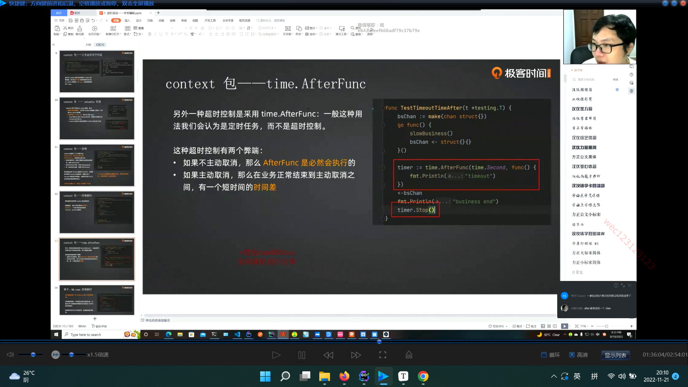

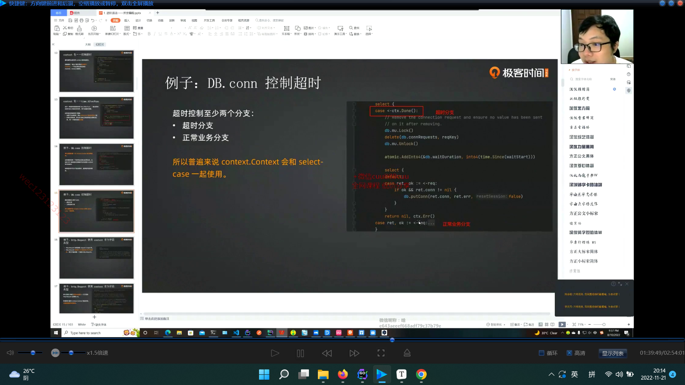

#### cancelCtx 

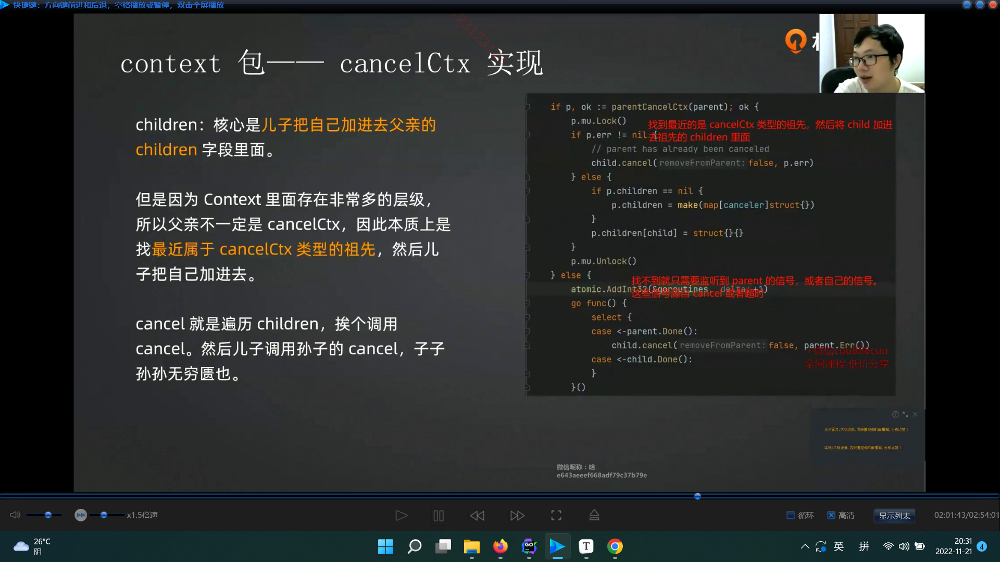

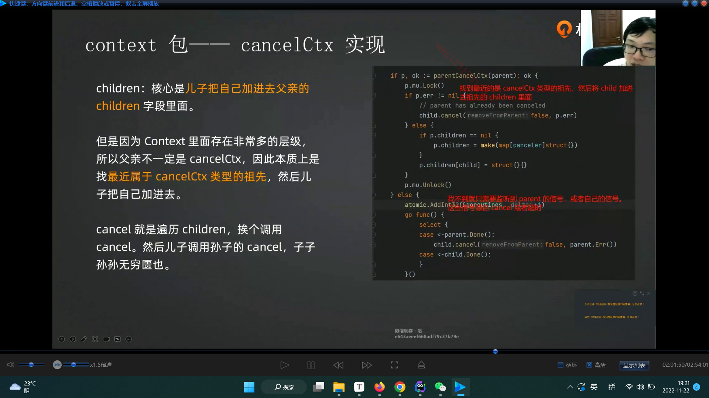

### sync

#### double-check

双重检查，读写锁时可以用到。

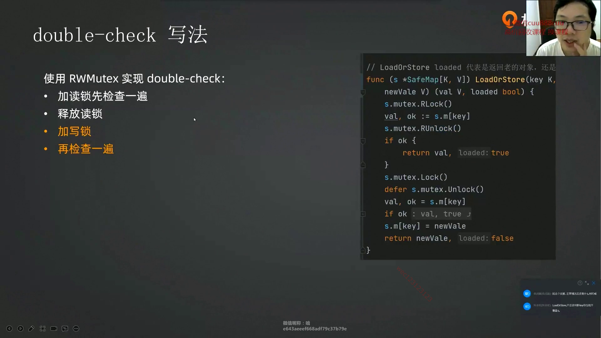

#### mutex

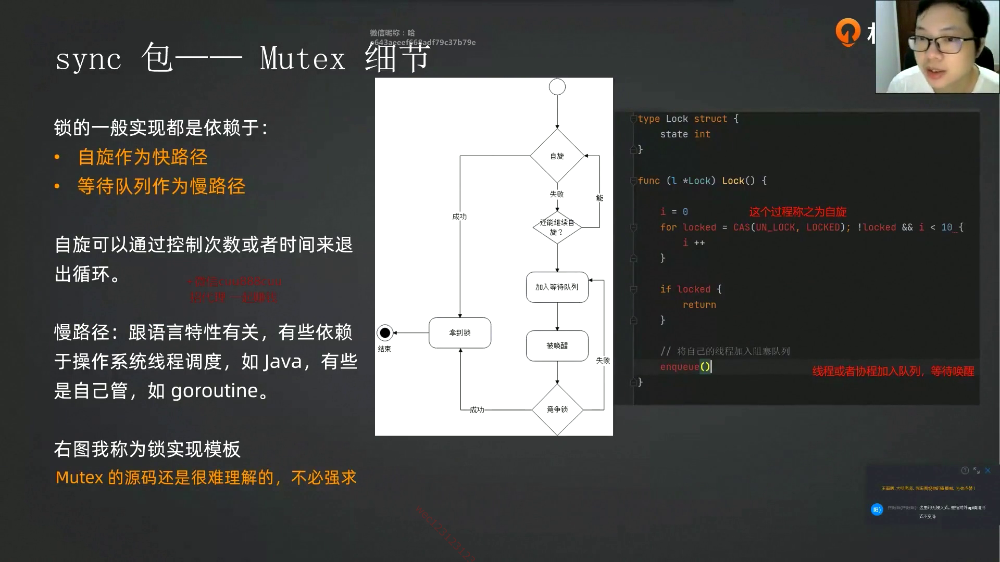

#### pool

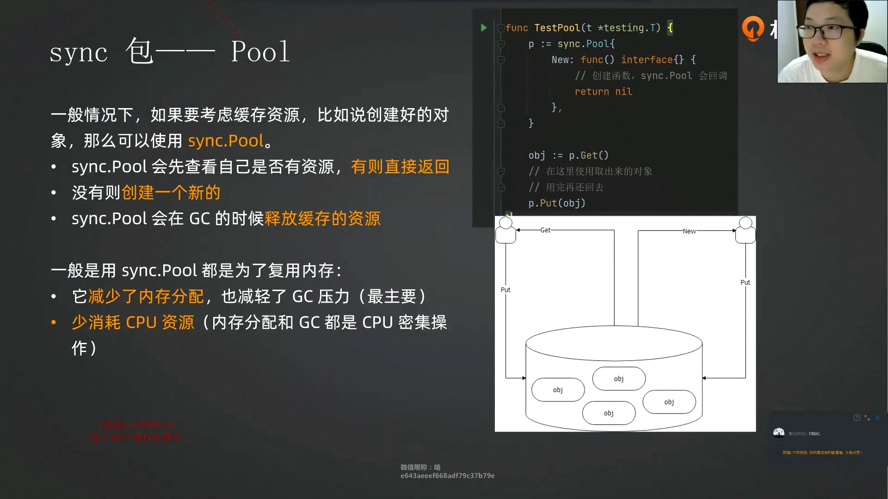

先找自己私有的，再找自己共享的。还找不到就找别人（别的gorounte）共享的,还找不到就找victim(缓刑的，即将被垃圾回收的)，最后还没有就只能创建一个新的了。

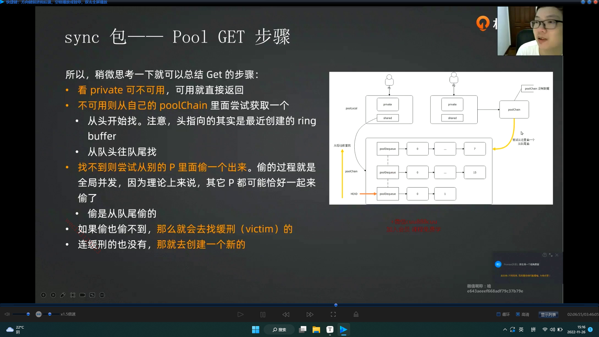

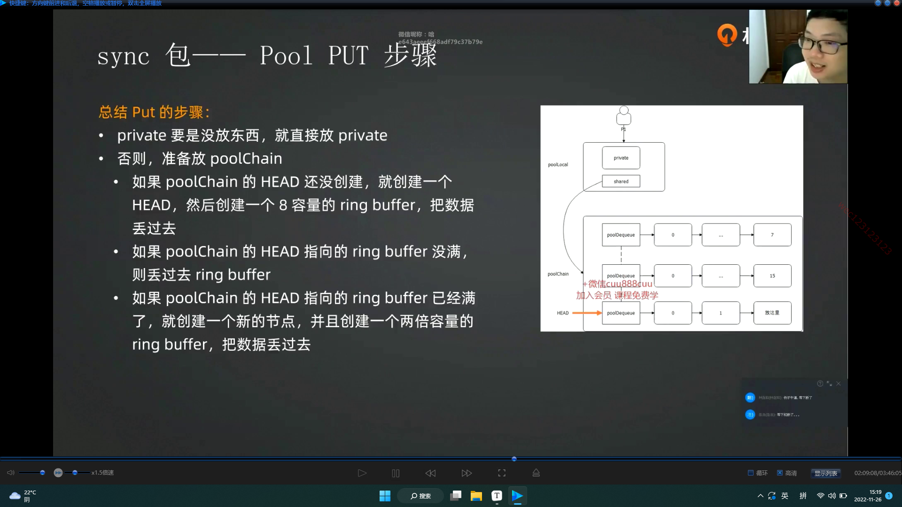

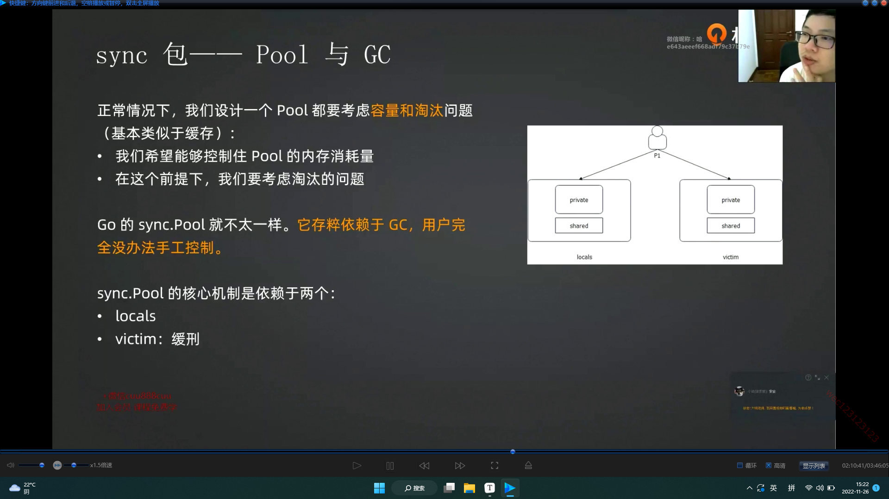

## 功能

### 优雅退出服务器

需求流程：

- 拒绝新请求

	每个服务结构体通过装饰器模式添加字段reject，要拒绝时将reject改为true。而每个新请求进去都先进入服务的ServeHTTP函数，然后才找到路由加载，故可在ServeHTTP头部添加判断reject，从而过滤新请求。

- 加载已有请求

	关闭时sleep一段时间即可，或者实时监听每个请求的结束

- 关闭系统资源

- 执行回调

如何强制退出：

第一次按ctrl c,先正常关闭，如果关闭超时或第二次按ctrl c 则强制退出。可嵌套select来实现监听两个阶段的信号。