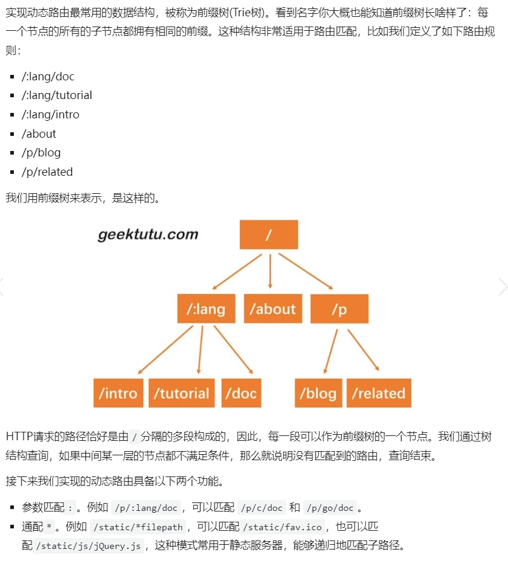

## Gee


### 介绍：

web框架


### 知识点：

为什么要设计上下文？

```
1 对Web服务来说，无非是根据请求*http.Request，构造响应http.ResponseWriter。但是这两个对象提供的
接口粒度太细，比如我们要构造一个完整的响应，需要考虑消息头(Header)和消息体(Body)，而 Header 包含
了状态码(StatusCode)，消息类型(ContentType)等几乎每次请求都需要设置的信息。因此，如果不进行有效
的封装，那么框架的用户将需要写大量重复，繁杂的代码，而且容易出错。针对常用场景，能够高效地构造出 
HTTP 响应是一个好的框架必须考虑的点。

2 针对使用场景，封装*http.Request和http.ResponseWriter的方法，简化相关接口的调用，只是设计 
Context 的原因之一。对于框架来说，还需要支撑额外的功能。例如，将来解析动态路由/hello/:name，
参数:name的值放在哪呢？再比如，框架需要支持中间件，那中间件产生的信息放在哪呢？Context 随着每一
个请求的出现而产生，请求的结束而销毁，和当前请求强相关的信息都应由 Context 承载。因此，设计
Context 结构，扩展性和复杂性留在了内部，而对外简化了接口。路由的处理函数，以及将要实现的中间件，
参数都统一使用 Context 实例， Context 就像一次会话的百宝箱，可以找到任何东西。
```


前缀树路由




### 难点：

如何实现中间件？中间件摆放位置在哪里，使用顺序如何？

```
摆放在全局的Group中，以此对所有路由加以控制。通过方法中循环和递归来控制顺序
```


如何错误恢复？

```
panic后仍会执行defer,故在defer中使用recover捕获错误，截停之后的错误代码执行，同时可读取
函数栈来返回错误信息的位置
```