## 学习

[网址](https://www.bilibili.com/video/BV12J41137hu?p=16&vd_source=3ec975651088fba288a277c53f0bcc77)

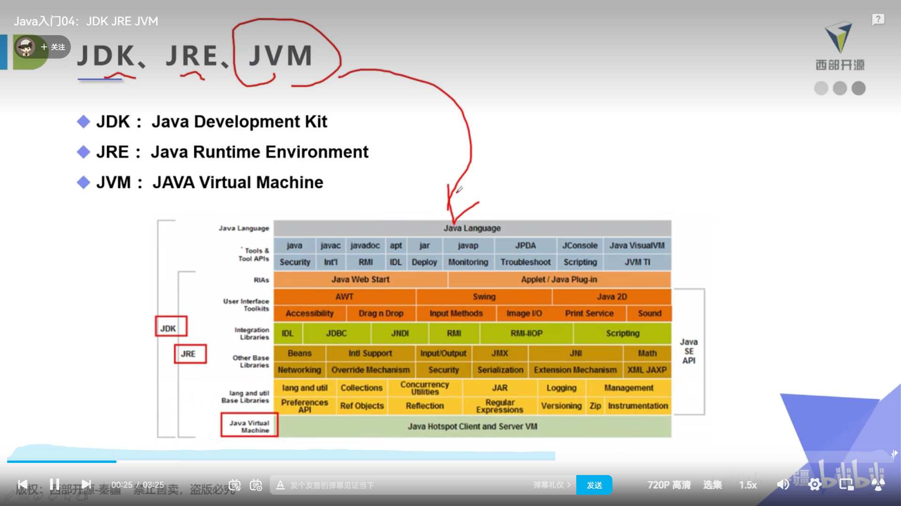


## 使用

### 运行

```
javac Hello.java
java Hello
```


### 类型

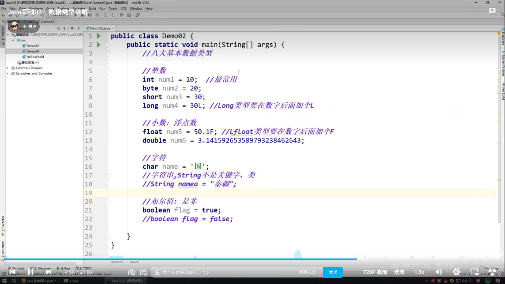


浮点数不精确，大约数，接近的两数可能不相等，应避免使用float比较

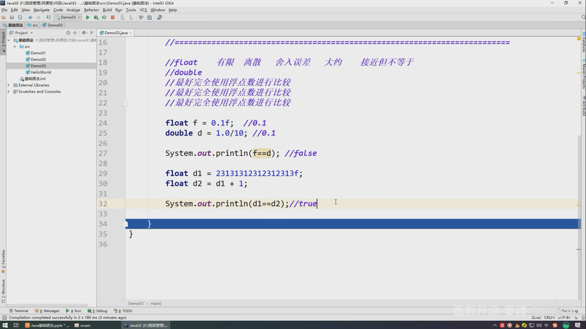


类型从低到高，需要强制转换，可能会内存溢出或精度缺失

类型从高到低，会自动转换

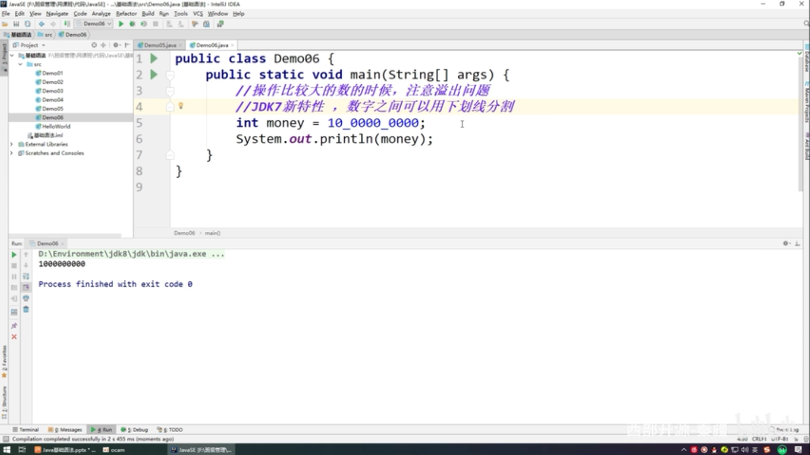


### 常量

```
final int PI = 3.14;
```


### 包

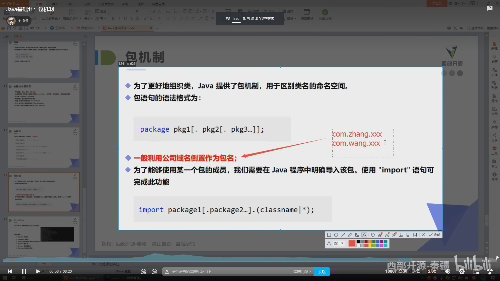


### 生成规范文档

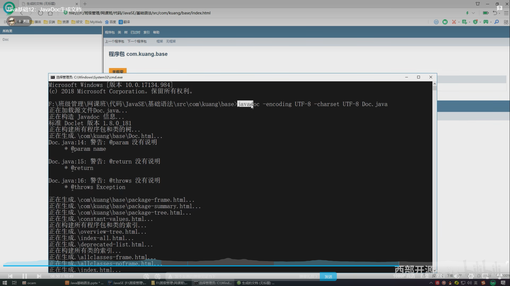


### 输入


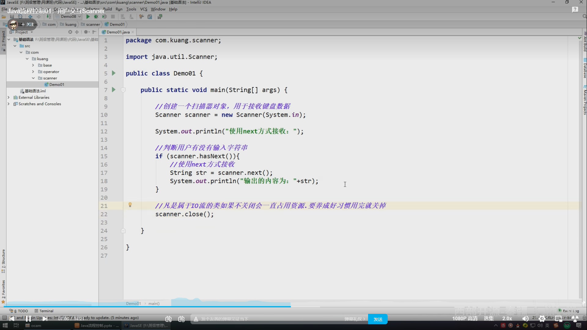

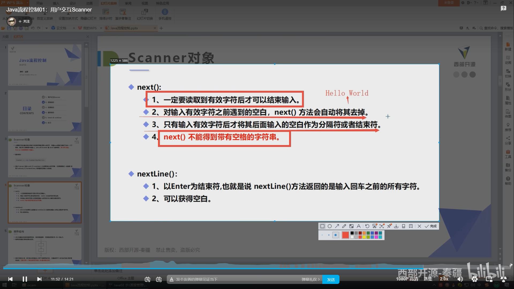


### switch

和js一样


### 对象

#### 构造器

```
与类名相同且没有返回值
```

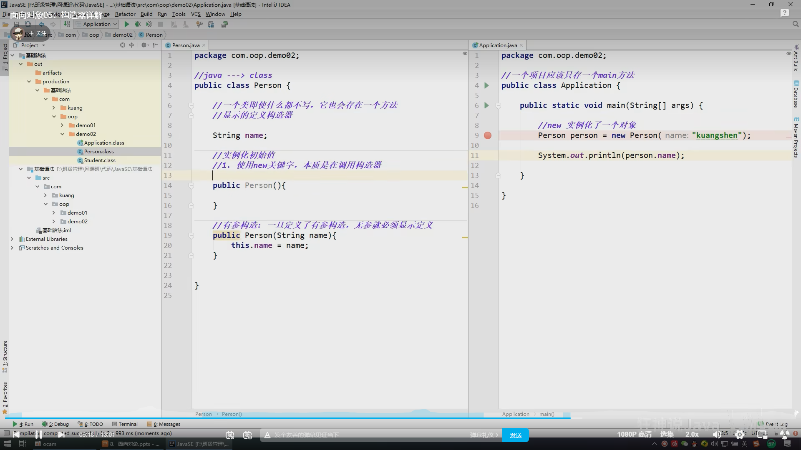


#### get/set

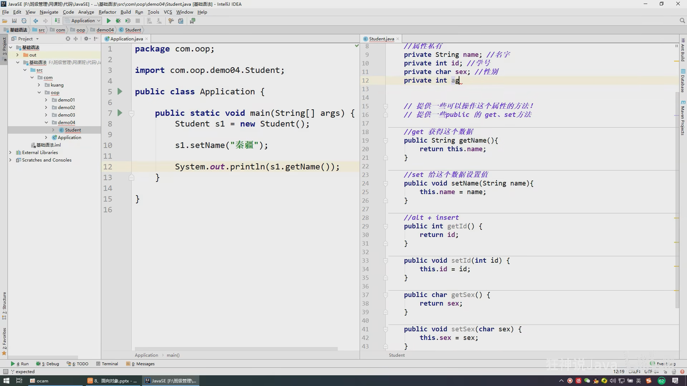


```


protected 受保护的数据
this.func() 当前类的方法
super.func() 父类的方法
A instanceof B 判断A和B是否有继承关系
接口可以继承
abstract 抽象类
```


#### 抽象类

```
抽象类是它的所有子类的公共属性的集合，主要用来进行类型隐藏
```


### 接口

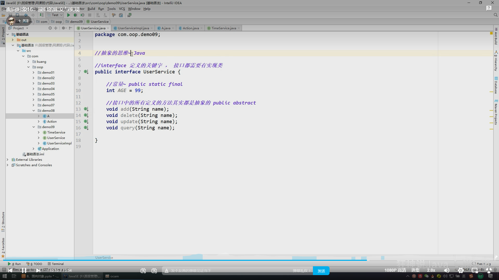


## 知识点


### 运行

```
javac 会编译成类，java 运行类，如果类有包名，如parent.children.eat,则需要cd回到parent的上级目录，
然后java parent.children.eat才能运行该eat类
```


### 方法类型

```
静态方法不需要实例化对象，即可通过类名调用
非静态方法需要实例化的对象才能使用
```


### 方法重载

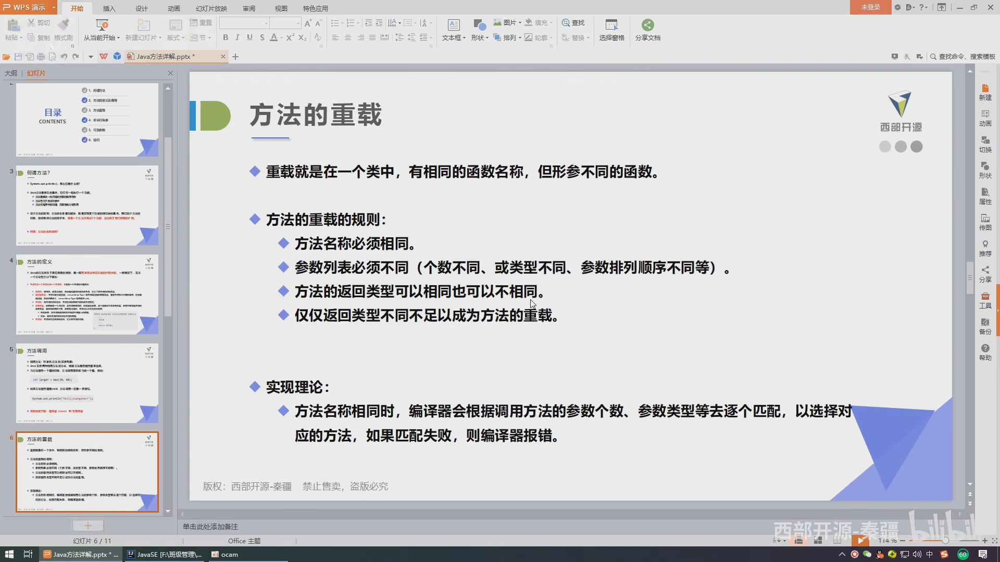

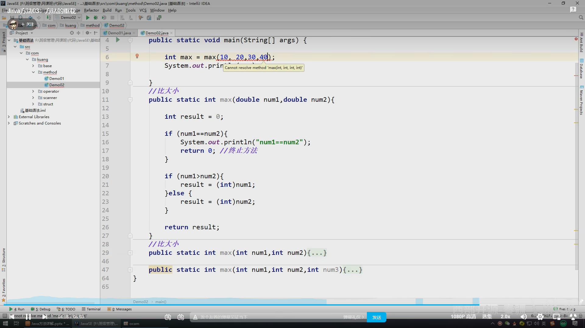


### 可变参数

必须为最后的参数，不允许多个可变参数，即使类型不同

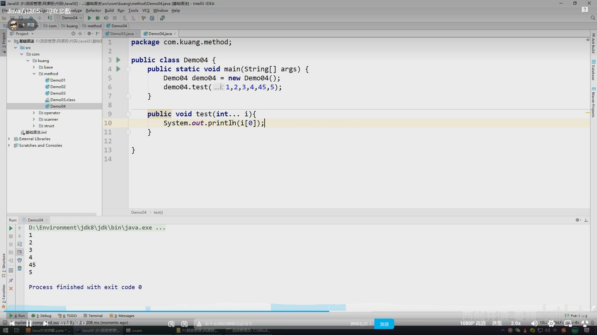


### 稀疏数组

只记录有效值，减少内存使用

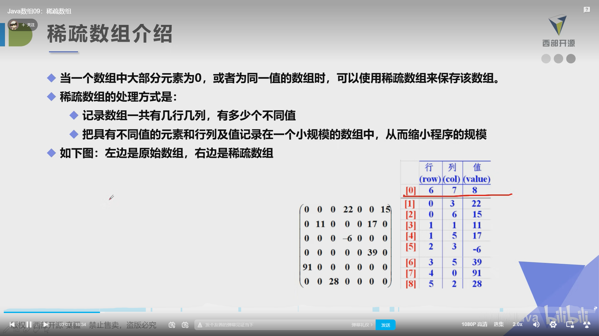


### 异常机制

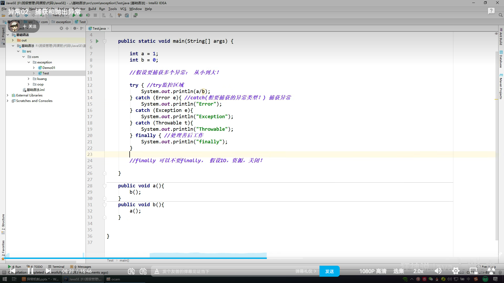


#### 抛出异常

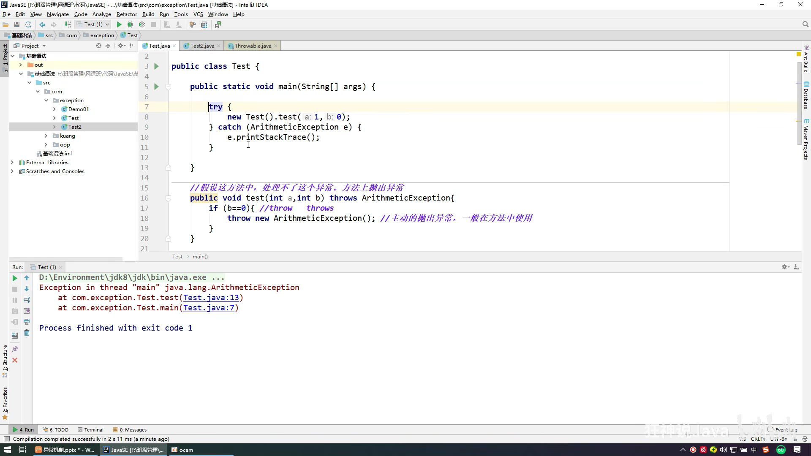


### 面向过程与面向对象

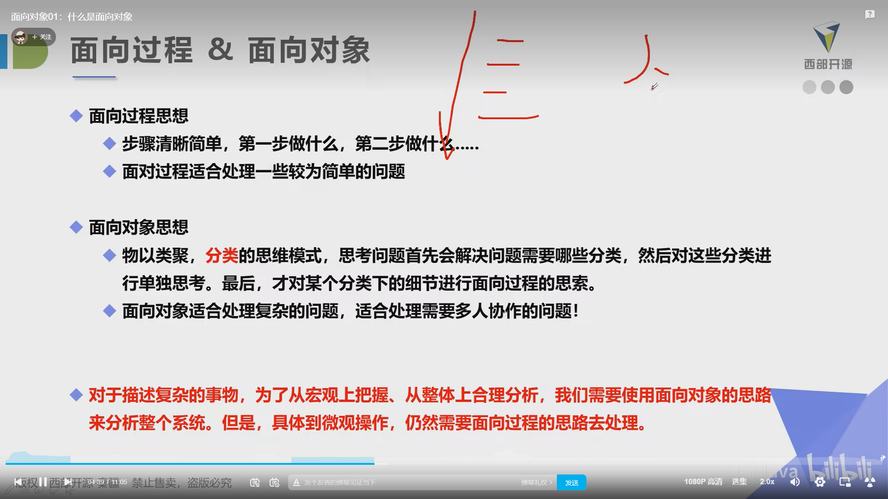


### throws

```
抛出异常
```


## 功能