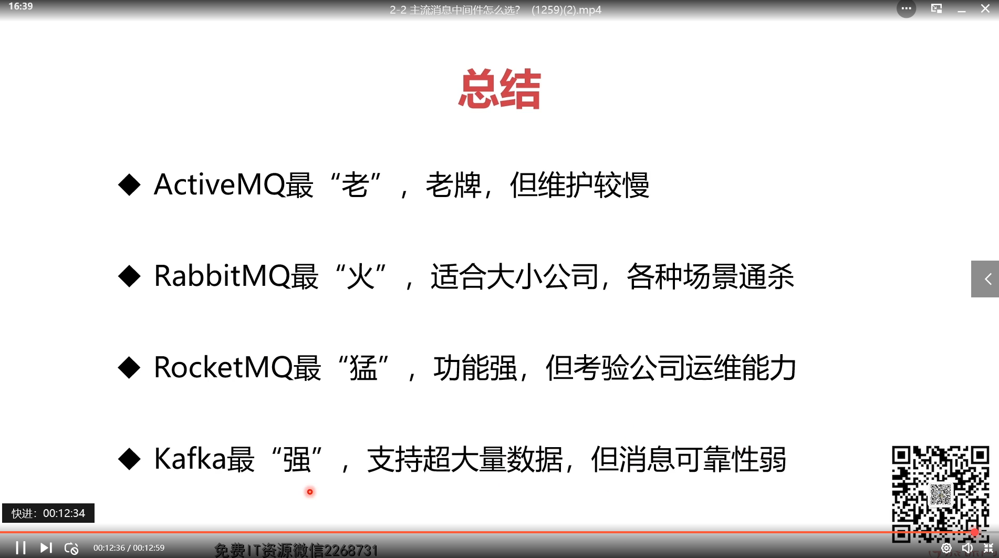
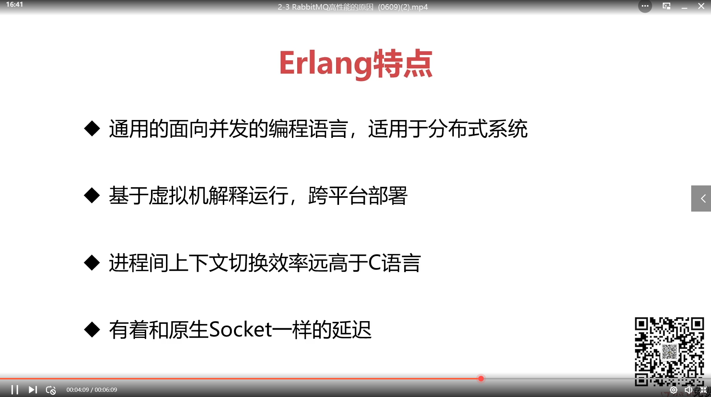
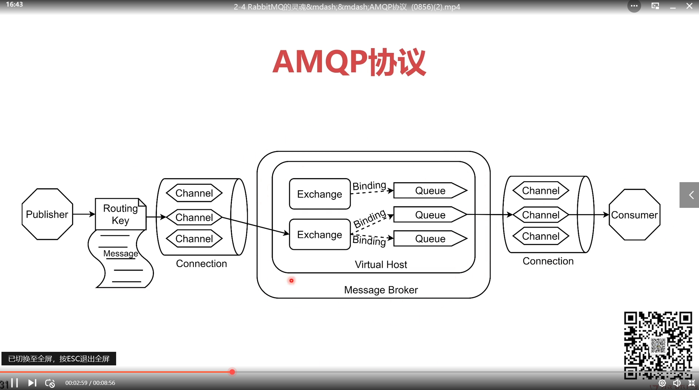
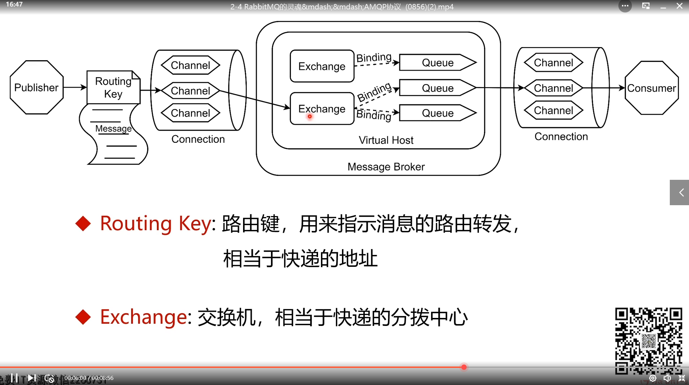
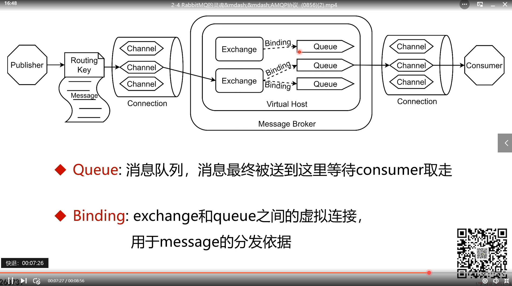
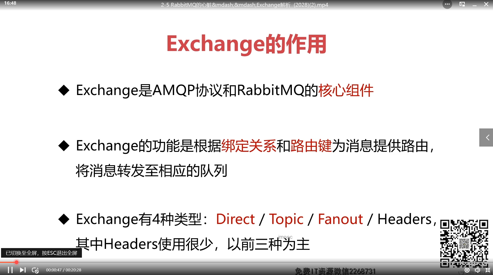
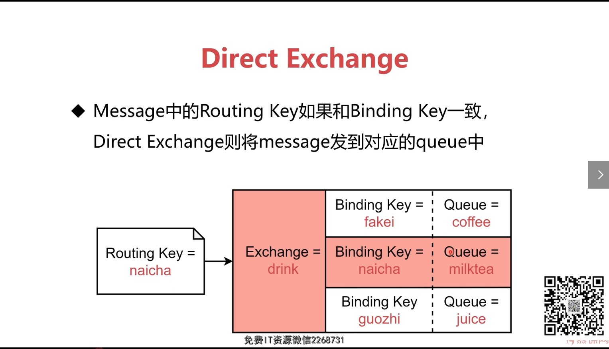
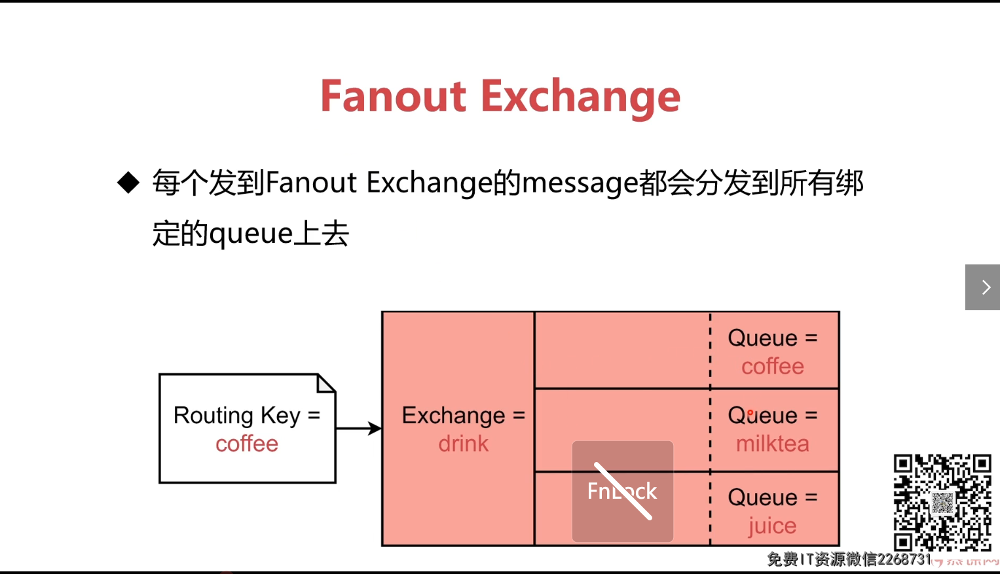
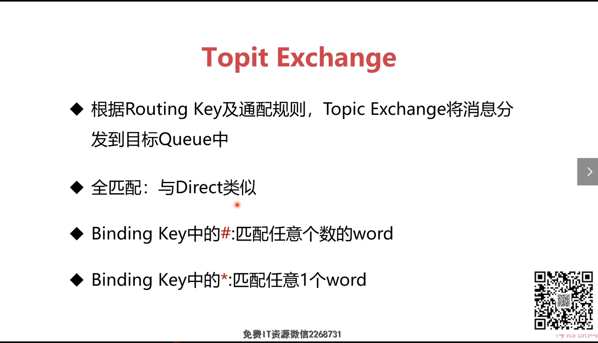
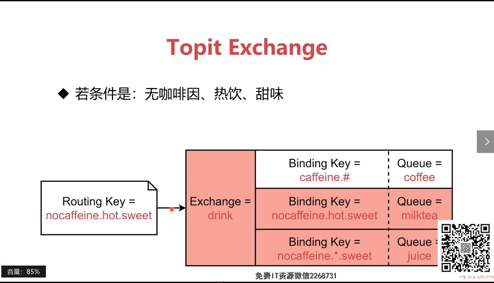

## 知识点

### 主流消息队列

rocketMQ：阿里开发，经受双十一的考验

kafka:多用于大数据，有低出错几率

RabbitMQ：最主流

### AMQP协议

- Broker：代表rabbitMQ中间件
- Host: 虚拟机，隔绝环境
- Connection: 与生产者消费者的TCP连接
- Channel: 每个线程都会创建一个管道

### Exchange交换机

#### Direct

直接交换机，只发到对应Key的队列

#### Fanout

扇形展开，相当于广播

#### Topic

有路由匹配

