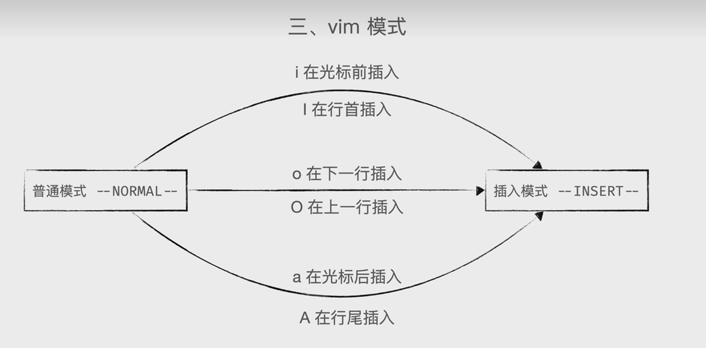
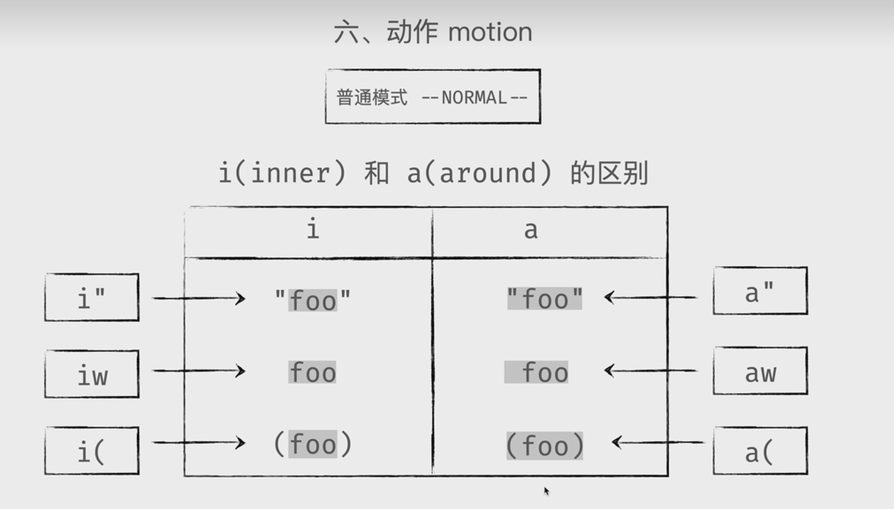
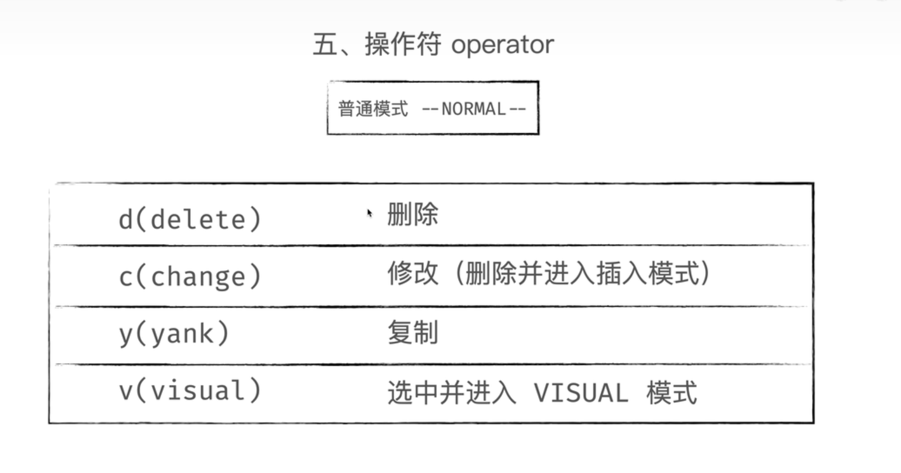
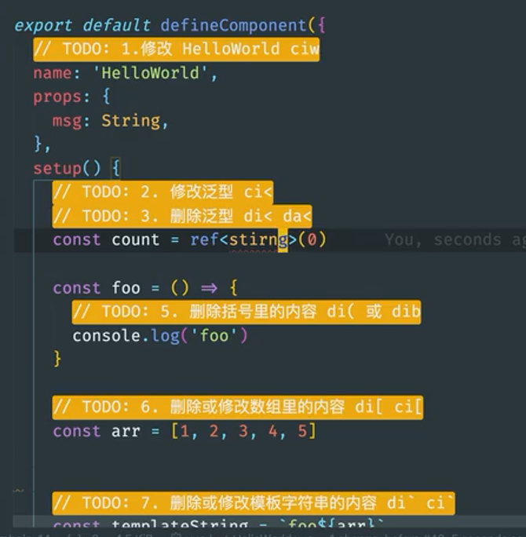
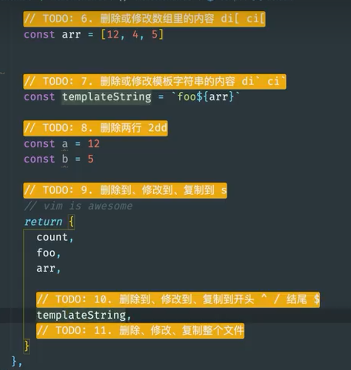
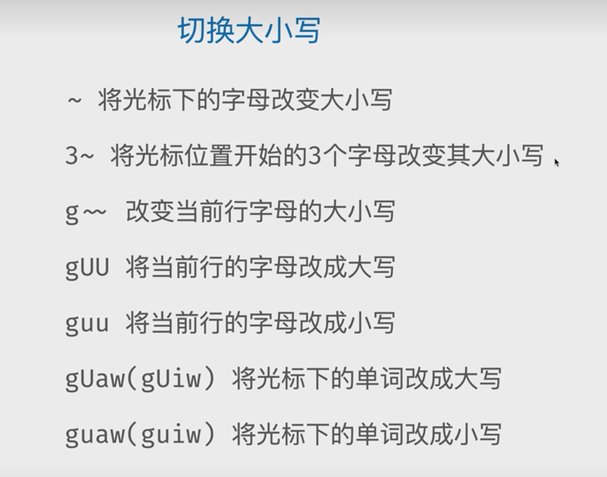
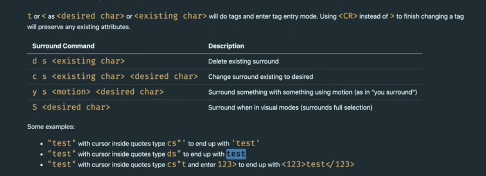
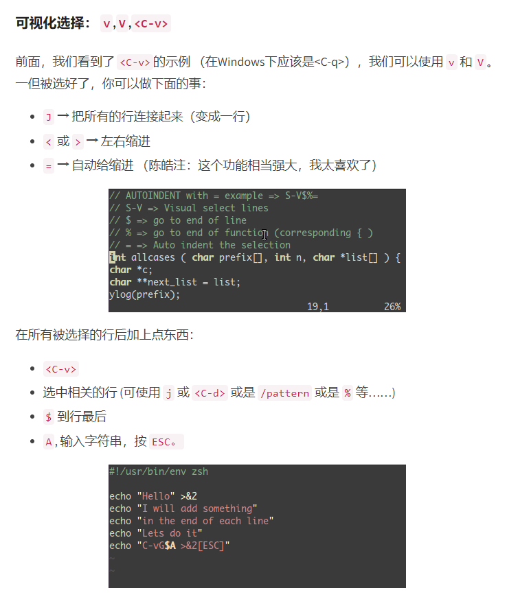
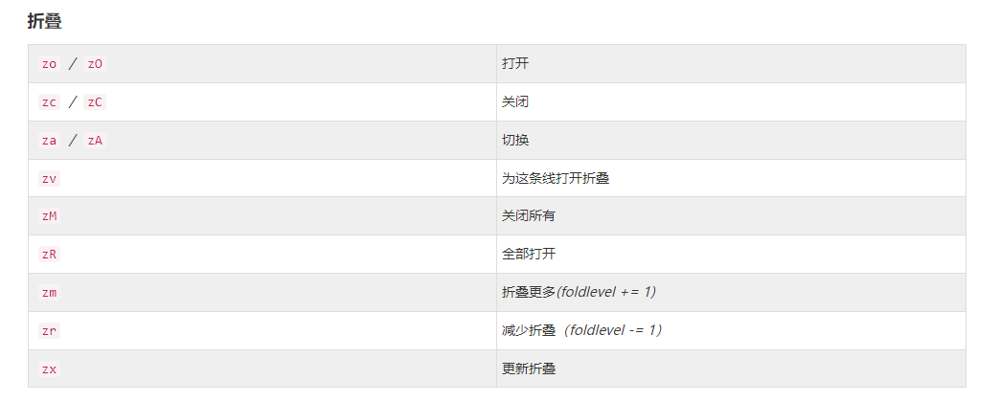

## 学习

[网址](https://www.bilibili.com/video/BV1z541177Jy?p=4&spm_id_from=pageDriver&vd_source=3ec975651088fba288a277c53f0bcc77)

[ideaVim配置](https://blog.csdn.net/Leiyi_Ann/article/details/122239909)

[指令查阅](https://www.w3cschool.cn/vim/cjtr1pu3.html)

## 知识点

### 模式

esc 插入模式

i  I  插入模式

v 可视模式

：命令模式

### 快捷键

gg 第一行

G 最后一行

^ 行首

$ 行尾

f+{char} 跳到当前行的下一个要查找的字母位置

; 重复之前查找操作

，撤销之前查找操作

dit  删除标签里的内容

is / as 句子

p 粘贴

u 撤销动作+操作符

ciw 选中单词删除并进入插入模式

ci(  删除括号内容

yiw 选中并复制单词

diw 选中并删除单词

ci< 选中被<>包围的单词并修改

ndd/cc/yy 向下删除/修改/复制n行,包括当前行

d/c/yf{char} 删除/修改/复制到向后的char字符

d/c/y^/$ 删除/修改/复制到开头/结尾切换大小写

~ 将光标下的字母改变大小写

3~ 将光标位置开始的3个字母改变大小写

g~ 改变当前行字母的大小写

gUU 将当前行的字母改成大写

guu 将当前行的字母改成小写

gUaw(gUiw) 将光标下的单词改成大写

guaw(guiw) 将光标下的单词改成小写

ctrl u/d 上/下一页

280G 定位280行

\> > 行首缩进

gg y G 复制整个文件

zo - 打开折叠
zc - 关闭折叠

:%s/abc/zzz/g 将abc全局替换为zzz

/xxx 查找xxx

组合动作

​				

gd   （goto define）查看源码

gh   查看注释

gt （goto tab）往后跳页面 ， 4gt 跳到第四个tab页面

gT  往前跳页面

`zz` 改变窗口的整体位置，将当前光标所在处 移动到窗口中部''

surround插件用法

ysiw"   单词两边添加"

## 注意

easymotion 查找后按大写会光标选中区域，按小写会跳转到字母位置

multiple-cursors 原生是按alt n 才起作用,可以映射修改