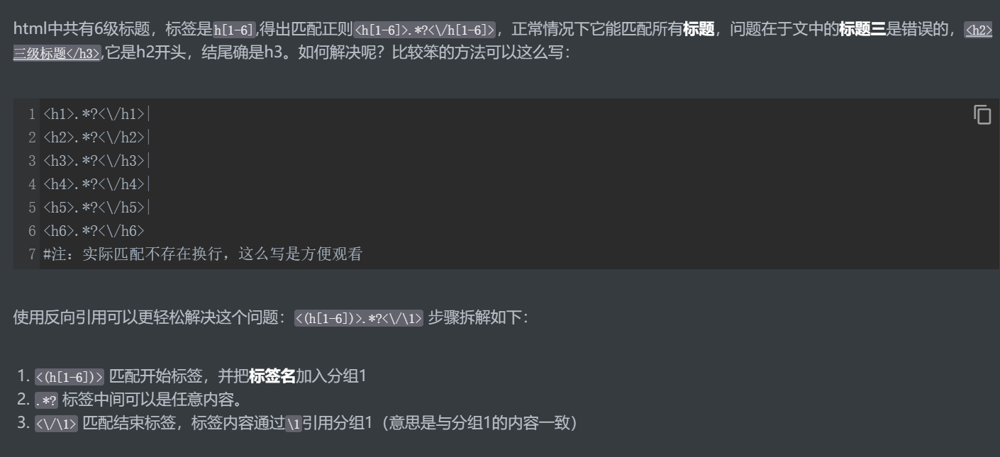
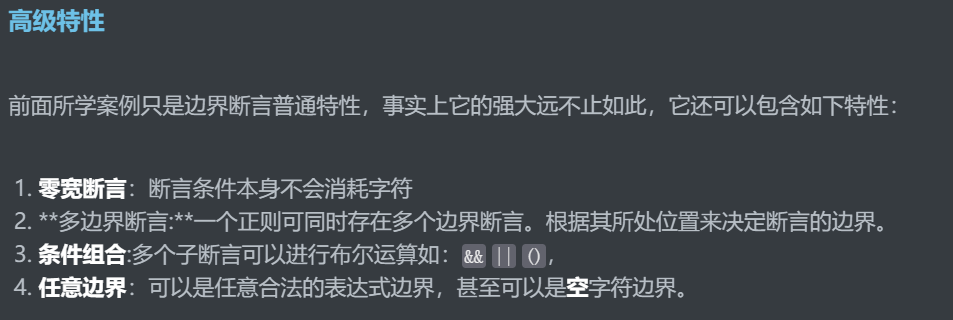
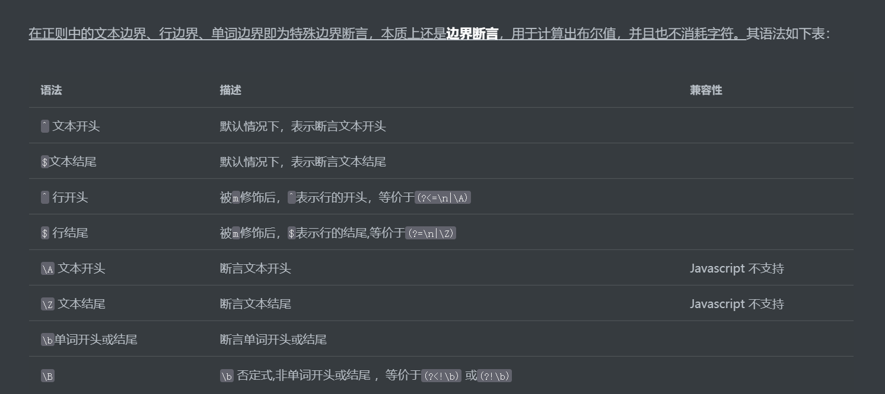

## 学习

[网址](https://reg.coderead.cn/?u_dit=bili2#/course/regex)


## 知识点

```
[0-9]等同于\d，表示匹配0-9的单个数字
```

```
.不包括换行符，但\s包括
```

```
[A-Z^IO] 要大写字母，又想排除I和O,这么写是不对的。A-Z已经包含I和O了,匹配字符中有I和O也会匹配A-Z
导致^IO不起作用
```

```
量词后面不能在加量词,如a**,a{1,3}*，?可加在量词后面，表示最少化匹配
```

```
同一个分组如果使用了量词，该分组会代表多个值，这时通过$组号去提取值的时候会得到该组最后匹配的值。
如(\d)+ 匹配12345，通过$1将得到5
```


### 反向引用

```
在表达式中引用之前的分组，即反向引用。
```




### 替换

替换操作指将正则匹配到的内容，替换成指定字符串，该字符串可通过`$组号`引用组进行拼装。通过`$0`可以引用整个匹配的内容。比如：日期“1960/02/19”被匹配之后 `$0`表示整个日期，`$1、$2、$3` 分别表示年月日。请注意反向引用与替换引用的**语法区别**，前者是使用`\组号`，而替换使用`$组号`。


### 命名分组

```
(?<title>),命名了一个名为title的分组,但不能使用反向引用\title，故较少使用
```


### 移除分组

```
(?:)
```


### 断言




