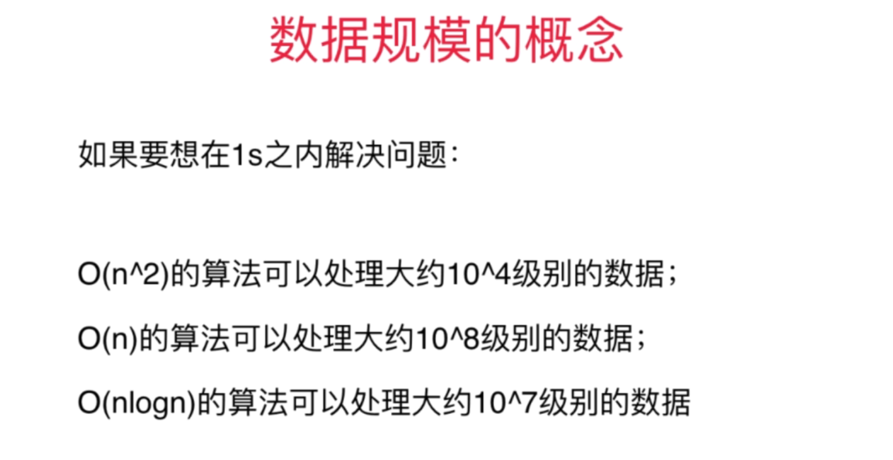
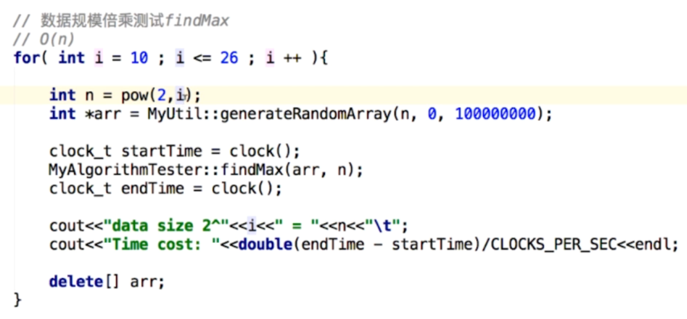
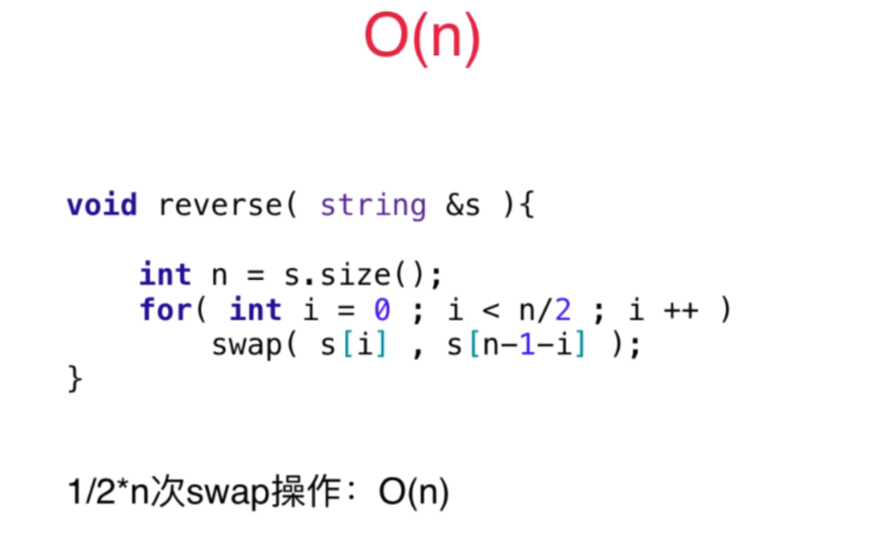
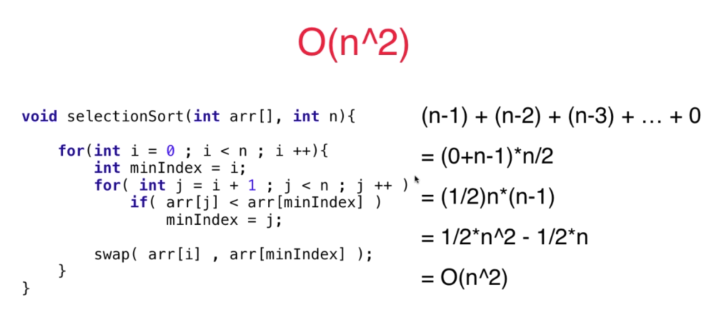
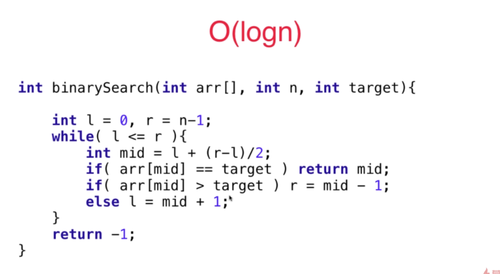
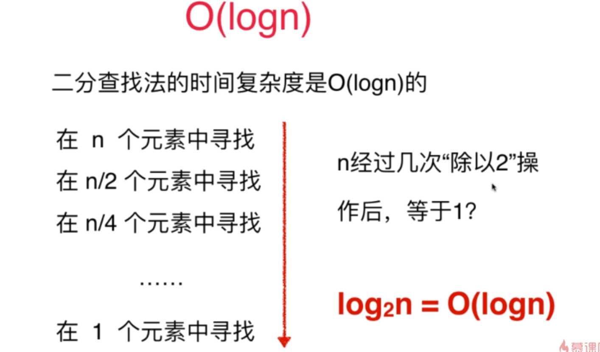
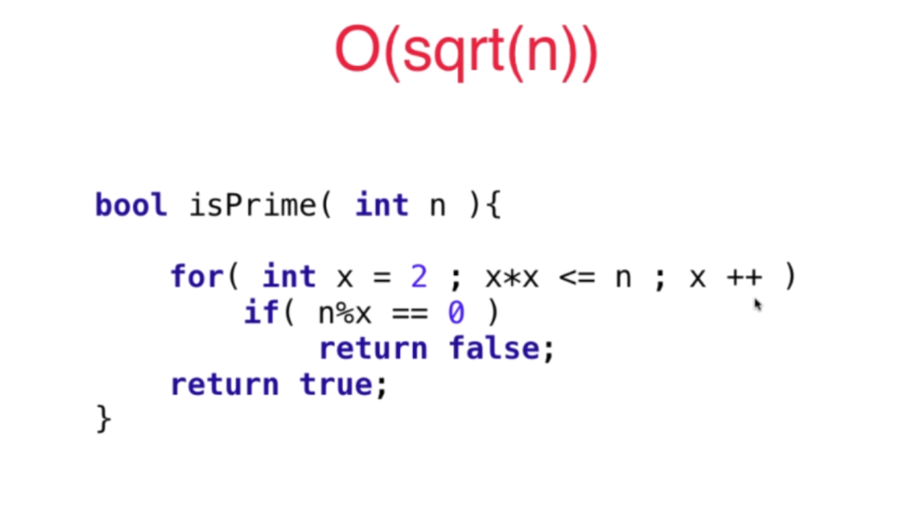
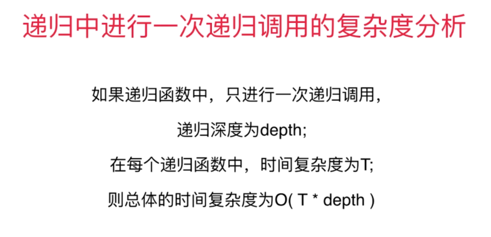

### 时间复杂度计算

#### 数据规模概念

#### 验算复杂度

对每次操作计时，然后逐步翻n倍（通常n = 10）来增加数据量，再分析每次计时之间的差距。

O(n) 计时间差距n倍，O(n^2)计时差距为4*n倍， O(logn)计时间差距极小

#### 常见复杂度

#### 递归复杂度

每次递归中时间度*递归深度

### 习题分类

#### 滑动窗口（6）

209 3 483 76 219 220

#### 查找相关（13）

242 202 290 205 451

1 15 18 16 	

454 49 

447 149 

#### 链表（12）

206 92 82 86 328 2 445 

203 21 25 147

237

#### 树（7）

437 

##### 二分搜索树

235 98 450 108 230 236

#### 双指针&链表（5）

11 19 61 143 234

#### 栈和队列（4）

20 150 71 341 

#### 树&队列（4）

102 107 199 

#### 图&队列（3）

279 127 126

#### 优先队列（2）

347 23

#### 递归和回溯（19）

##### 树形问题

17 93 131 46 47

##### 组合问题

77 39 40 216 78 90 401

##### 二维平面问题

79 200 130 417 51 52 37

#### 动态规划

70 120 64 343 279 91 62

198 213 337 309

300 376

#### 背包问题

416 322 377 474 139 494 

300 376

#### 贪心算法

455 392

435