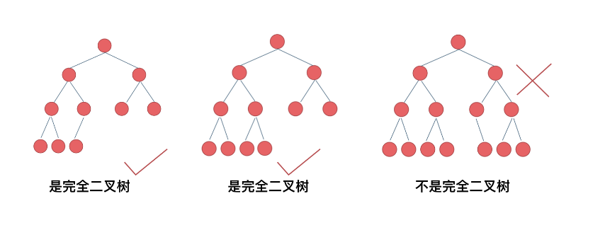

## 题解

### 数据结构

```
在计算机科学中，数据结构是计算机中存储、组织数据的方式。

正确的数据结构选择可以提高算法的效率。在计算机程序设计的过程中，
选择适当的数据结构是一项重要工作。许多大型系统的编写经验显示，
程序设计的困难程度与最终成果的质量与表现，取决于是否选择了最适合的数据结构
```


#### 136. 只出现一次的数字

```python
描述：给定一个非空整数数组，除了某个元素只出现一次以外，
	 其余每个元素均出现两次。找出那个只出现了一次的元素。
新思路：可以用异或查找单独项，前提是只存在唯一元素出现一次，其余元素出现两次。
原理：无论顺序，相同元素最终都会异或到，则结果为000000，而唯一存在的元素与0异或等于元素本身。
代码：
class Solution:
    def singleNumber(self, nums):
        a = 0
        for num in nums:
            a = a ^ num
        return a
```

####  169. 多数元素

```python
描述：给定一个大小为 n 的数组，找到其中的多数元素。多数元素是指在数组中出现次数 大于 ⌊ n/2 ⌋ 的元素。
你可以假设数组是非空的，并且给定的数组总是存在多数元素。
新思路：少用二级循环，此题用一重循环的摩尔投票法
原理：对拼消耗，遇到相同数计数加一，否则减一，若计数为零则换下一个元素继续对拼.
由于多数元素大于一半，结果肯定计数不为零。
疑惑：计数变为负数怎么办？
解答：不会变为负数，更换下一元素后下一次遍历总会使计数加一
代码：
class Solution(object):
    def majorityElement(self, nums):
        """
        :type nums: List[int]
        :rtype: int
        """
        num = nums[0]
        count = 1

        for i in range(2, len(nums)):
            if nums[i-1] == num:
                count += 1
            else:
                count -= 1
                if count == 0:
                    num = nums[i]
            print('count=',count)
        print(num)
        return num
```

####  [15. 三数之和](https://leetcode-cn.com/problems/3sum/)

```python
不通过：超出时间限制，还是for循环过多
本人代码(写出了三种，可在letcode查看)：
class Solution(object):
    def threeSum(self, nums):
        """
        :type nums: List[int]
        :rtype: List[List[int]]
        """
        # 排序
        nums.sort()
        # print(nums)
        # 查找
        lst = []
        length = len(nums)
        for i in range(0, length):
            # 去重
            if 1 < i < length - 2 and nums[i] == nums[i - 1]:
                continue
            # 大于零结束
            if nums[i] > 0:
                break
            for j in range(i + 1, length - 1):
                # 去重
                if i + 2 <= j < length - 2 and nums[j] == nums[j - 1]:
                    continue
                res = -(nums[i] + nums[j])
                # print(res, nums[j + 1:])
                if res in nums[j + 1:]:
                    lst.append([nums[i], nums[j], res])
        # print(lst)
        # return lst

        # 去重
        new_lst = []
        for i in range(0, len(lst)):
            if lst[i] not in new_lst:
                new_lst.append(lst[i])
        # print(new_lst)
        return new_lst
```

####  [70. 爬楼梯](https://leetcode-cn.com/problems/climbing-stairs/)

```
描述：假设你正在爬楼梯。需要 n 阶你才能到达楼顶。
每次你可以爬 1 或 2 个台阶。你有多少种不同的方法可以爬到楼顶呢？

本人思路：先遍历找出所有成功的一二阶阶数，在排列组合计算每一方法的组合数，最后汇总为结果（已成功）

新思路：仔细发现，第n个台阶只能从第n-1或者n-2个上来。
到第n-1个台阶的走法 + 第n-2个台阶的走法 = 到第n个台阶的走法，
已经知道了第1个和第2个台阶的走法，一路加上去。本质与斐波那契思路一致

摘抄案例和热评:
https://leetcode-cn.com/problems/climbing-stairs/comments/115749
```

#### [56. 合并区间](https://leetcode-cn.com/problems/merge-intervals/)

```
描述：以数组 intervals 表示若干个区间的集合，其中单个区间为 intervals[i] = [starti, endi] 。
请你合并所有重叠的区间，并返回一个不重叠的区间数组，该数组需恰好覆盖输入中的所有区间。

原思路：碰壁了！

新思路：先排序，排序后能合并的区间一定连续。故之后就两种情况，能合并合并，不能合并则添加到数组末尾，
然后作为新的判断区间

题解：https://leetcode-cn.com/problems/merge-intervals/solution/he-bing-qu-jian-by-leetcode-solution/
```

####  [119. 杨辉三角 II](https://leetcode-cn.com/problems/pascals-triangle-ii/)

[题解](https://leetcode-cn.com/problems/pascals-triangle-ii/solution/119-yang-hui-san-jiao-ii-python-by-sanct-zich/)

```
题解中的r[j] = r[j] + r[j+1] ，后r[j]是i-1行的r[j]
```

####  [59. 螺旋矩阵 II](https://leetcode-cn.com/problems/spiral-matrix-ii/)

```
感受：简单的问题想复杂了，或者说想的不够透彻
一直按右下左上的顺序执行，故循环即可
```


### 动态规划

```
动态规划常常适用于有重叠子问题和最优子结构性质的问题，并且记录所有子问题的结果，
因此动态规划方法所耗时间往往远少于朴素解法。

动态规划有自底向上和自顶向下两种解决问题的方式。自顶向下即记忆化递归，自底向上就是递推。

使用动态规划解决的问题有个明显的特点，一旦一个子问题的求解得到结果，以后的计算过程就不会修改它，
这样的特点叫做无后效性，求解问题的过程形成了一张有向无环图。动态规划只解决每个子问题一次，
具有天然剪枝的功能，从而减少计算量。
```


####  [746. 使用最小花费爬楼梯](https://leetcode-cn.com/problems/min-cost-climbing-stairs/)

```python
描述：数组的每个下标作为一个阶梯，第 i 个阶梯对应着一个非负数的体力花费值 cost[i]（下标从 0 开始）。
每当你爬上一个阶梯你都要花费对应的体力值，一旦支付了相应的体力值，你就可以选择向上爬一个阶梯或者爬两个阶梯。
请你找出达到楼层顶部的最低花费。在开始时，你可以选择从下标为 0 或 1 的元素作为初始阶梯。

原思路：不通！

新思路：不大懂

代码：
class Solution(object):
    def minCostClimbingStairs(self, cost):
        """
        :type cost: List[int]
        :rtype: int
        """
        p1 = 0
        p2 = 0

        for i in range(2, len(cost) + 1):
            p1, p2 = p2, min(p2 + cost[i - 1], p1 + cost[i - 2]) 
        return p2
```

####  [198. 打家劫舍](https://leetcode-cn.com/problems/house-robber/)（经典）

```python
描述：你是一个专业的小偷，计划偷窃沿街的房屋。每间房内都藏有一定的现金，
影响你偷窃的唯一制约因素就是相邻的房屋装有相互连通的防盗系统，如果两间相邻的房屋在同一晚上被小偷闯入，
系统会自动报警。给定一个代表每个房屋存放金额的非负整数数组，
计算你 不触动警报装置的情况下 ，一夜之内能够偷窃到的最高金额。(与上题使用最小花费爬楼梯思路类似)

原思路：最大值，结果列表lst尾部n-1为最大值（当前第一套方案），n-2为之前第二套方案。若第二套加上
当前元素大于lst[n-1]则最大值（当前第一套方案）更新为第二套加上当前元素，否则继续执行第一套方案
（解释不够清晰）
（思路正确，但遇到数组索引超标问题。因避免nums[i+1]之类写法，使用nums[i-1]确定元素存在的写法）

代码：
class Solution(object):
    def rob(self, nums):
        """
        :type nums: List[int]
        :rtype: int
        """
        p = []
        n = len(nums)
        print(n, nums[0])
        if n == 1:
            return nums[0]
        elif n == 0:
            return 0
        p.append(nums[0])
        p.append(max(nums[0], nums[1]))
        for i in range(2, n):
            p.append(max(p[i - 2] + nums[i], p[i - 1]))
        return p[n - 1]


```

####  [740. 删除并获得点数](https://leetcode-cn.com/problems/delete-and-earn/)

```
描述：给你一个整数数组 nums ，你可以对它进行一些操作。
每次操作中，选择任意一个 nums[i] ，删除它并获得 nums[i] 的点数。
之后，你必须删除 所有 等于 nums[i] - 1 和 nums[i] + 1 的元素。
开始你拥有 0 个点数。返回你能通过这些操作获得的最大点数。

总结：本质仍是动态，可转化为打家劫舍问题
```


#### [55. 跳跃游戏](https://leetcode-cn.com/problems/jump-game/)

```python
描述：给定一个非负整数数组 nums ，你最初位于数组的 第一个下标 。
数组中的每个元素代表你在该位置可以跳跃的最大长度。
判断你是否能够到达最后一个下标。

原思路：从后往前遍历，遇零则执行判断，要前面的数大于零坐标减当前坐标才能继续遍历，否则当坐标减到-1时
走不通，返回False（成功）

代码：
class Solution(object):
    def canJump(self, nums):
        """
        :type nums: List[int]
        :rtype: bool
        """
        n = len(nums)
        if nums[0] == 0 and n != 1:
            return False
        elif nums[0] == 0 and n == 1:
            return True
        for i in range(1, n):
            k = n - 1 - i
            if nums[k] == 0:
                j = k - 1
                while 1:
                    if j == -1:
                        return False
                    if nums[j] > nums[k] + k - j:
                        break
                    else:
                        j -= 1
        return True
```

#### [45. 跳跃游戏 II](https://leetcode-cn.com/problems/jump-game-ii/)

```python
描述：给你一个非负整数数组 nums ，你最初位于数组的第一个位置。
数组中的每个元素代表你在该位置可以跳跃的最大长度。
你的目标是使用最少的跳跃次数到达数组的最后一个位置。
假设你总是可以到达数组的最后一个位置。

思路：每一元素都遍历，只要考虑每一跳所能达到的最远位置就行了，也就是每次都选择最远可达的点

总结：也是要求动态规划，有两套方案对比，谁优选谁，之后又更新两套方案。使结果总在最优中变化

代码：
class Solution(object):
    def jump(self, nums):
        """
        :type nums: List[int]
        :rtype: int
        """
        if len(nums) == 1:
            return 0
        step = 0
        reach = 0
        nextReach = nums[0]
        for i in range(len(nums)):
            nextReach = max(i + nums[i], nextReach)
            if nextReach >= len(nums)-1:
                step += 1
                return step
            if i == reach:
                reach = nextReach
                step += 1
```

#### [53. 最大子序和](https://leetcode-cn.com/problems/maximum-subarray/)

题解：[最大子序和](https://leetcode-cn.com/problems/maximum-subarray/solution/zui-da-zi-xu-he-by-leetcode-solution/)

```python
描述：给定一个整数数组 nums ，找到一个具有最大和的连续子数组（子数组最少包含一个元素），返回其最大和。

原思路：没想出

解题思路：
1 贪心算法  只要前面总和大于零就相加到当前元素，否则不加
2 动态规划  要前一元素大于零才相加到当前元素

代码：
贪心算法和动态规划定义都符合
class Solution(object):
    def maxSubArray(self, nums):
        """
        :type nums: List[int]
        :rtype: int
        """
        n = len(nums)
        for i in range(1, n):
            nums[i] = nums[i] + max(nums[i - 1], 0)
        return max(nums)

```

#### [152. 乘积最大子数组](https://leetcode-cn.com/problems/maximum-product-subarray/)

```
描述：给你一个整数数组 nums ，请你找出数组中乘积最大的连续子数组（该子数组中至少包含一个数字），
并返回该子数组所对应的乘积。

思路：三个变量，一个记录最大数，一个记录最小数，一个记录结果。当前元素为负数时，最大最小数交换。
每一次都用max(结果变量，最大数)来更新结果变量
 
```


#### [19.正则表达式匹配](https://leetcode-cn.com/leetbook/read/illustration-of-algorithm/9a1ypc/)

```
状态定义： 设动态规划矩阵 dp ， dp[i][j] 代表字符串 s 的前 i 个字符和 p 的前 j 个字符能否匹配。

转移方程:  需要注意，由于 dp[0][0] 代表的是空字符的状态， 
		  因此 dp[i][j] 对应的添加字符是 s[i - 1] 和 p[j - 1] 。
          当 p[j - 1] = '*' 时， dp[i][j] 在当以下任一情况为 truetrue 时等于 truetrue ：

dp[i][j - 2]： 即将字符组合 p[j - 2] * 看作出现 0 次时，能否匹配；
dp[i - 1][j] 且 s[i - 1] = p[j - 2]: 即让字符 p[j - 2] 多出现 1 次时，能否匹配；
dp[i - 1][j] 且 p[j - 2] = '.': 即让字符 '.' 多出现 1 次时，能否匹配；
当 p[j - 1] != '*' 时， dp[i][j] 在当以下任一情况为 true 时等于 true ：

dp[i - 1][j - 1] 且 s[i - 1] = p[j - 1]： 即让字符 p[j - 1] 多出现一次时，能否匹配；
dp[i - 1][j - 1] 且 p[j - 1] = '.'： 即将字符 . 看作字符 s[i - 1] 时，能否匹配；
初始化： 需要先初始化 dp 矩阵首行，以避免状态转移时索引越界。

dp[0][0] = true： 代表两个空字符串能够匹配。
dp[0][j] = dp[0][j - 2] 且 p[j - 1] = '*'： 
首行 s 为空字符串，因此当 p 的偶数位为 * 时才能够匹配（即让 p 的奇数位出现 0 次，保持 p 是空字符串）。因此，循环遍历字符串 p ，步长为 2（即只看偶数位）。
返回值： dp 矩阵右下角字符，代表字符串 s 和 p 能否匹配

```


### 剑指offer


#### [09. 用两个栈实现队列](https://leetcode-cn.com/problems/yong-liang-ge-zhan-shi-xian-dui-lie-lcof/)

```
如何用两个栈模拟队列的先进先出的增删特性？
一个栈模拟添加
第二个栈模拟删除，当要删除时，若第二个栈为空，则将第一个栈全部弹出到第二个栈，则第二个栈顶为队列的
队头元素，故可以用栈特性来删除对头元素。若第二个栈不为空，则省去弹出操作，直接删除栈顶元素
```


## 二分查找

### 特征

在升序数组中查找目标数

或者查找目标数在升序数组中的边界


## 动态规划

### 特征

需要找最优解


原问题可分割成若干个子问题，每个子问题都得出最优解，汇总起来得到最终结果


使用回溯时间复杂度为O(2^n),为指数级别，容易超时，可使用字典记忆化搜索来减少时间


### 思路

先找好dp的最小安全区，然后每个子问题都基于上一个安全区做出最优选择


### 五步走

[网址](https://programmercarl.com/%E5%8A%A8%E6%80%81%E8%A7%84%E5%88%92%E7%90%86%E8%AE%BA%E5%9F%BA%E7%A1%80.html#%E5%8A%A8%E6%80%81%E8%A7%84%E5%88%92%E7%9A%84%E8%A7%A3%E9%A2%98%E6%AD%A5%E9%AA%A4)

1. 确定dp数组（dp table）以及下标的含义
2. 确定递推公式
3. dp数组如何初始化
4. 确定遍历顺序
5. 举例推导dp数组


## 背包问题

### 01背包问题

#### 特征

从数组中选某些数，其和接近数组中剩余数,每个数只能用一次


#### 思路

```
找出dp的容量后，最外层遍历扩容的n就是和容量相关的数，使得遍历完就能得到dp[n]作为结果。
```

```
1 找出目标和target，一般是总数除2，target同时作为dp数组容量，即背包的最大容量

2 每添加一个元素到要规划的数组中，那么dp就根据之前规划包装好的背包，来规划当前元素能放进哪些背包

3 每个元素放进某足够容量背包时，有两个选择，
  一 不放入背包，则当前dp背包继承之前位置的背包值。
  二 放入背包，则当前dp背包等于上次规划的符合的背包值  
```

```
要运用背包特性做题，比如背包容量为n时最多能装多少物品或者
容量为n时装满物品有多少种方法，
然后想想能否运用这个特性解题
```


#### 架构

[494目标和](https://leetcode-cn.com/problems/target-sum/)

```go
func findTargetSumWays1(nums []int, target int) int {
	// 计算总和和添加特殊条件
	sum := 0
	for _, v := range nums {
		sum += v
	}
	diff, n := sum-target, len(nums)
	if diff < 0 || diff%2 == 1 {
		return 0
	}
	
	// 初始化，边界条件
	neg := diff / 2
	dp := make([]int, n+1)
	dp[0] = 1
	
	// 外层代表每次加入的数，逐渐扩容的作用；内层代表因这个数的加入而重新规划背包
	for i := 0; i < len(nums); i++ {
		for j := neg; j >= nums[i]; j-- {
			dp[j] += dp[j-nums[i]]
		}
	}
	return dp[neg]
}
```


### 完全背包

#### 特征

从数组中选某些数，使其结果等于目标数，每个数可以无数次


#### 思路

```
循环顺序要根据结果是组合还是要求排列
若为组合，则先遍历物品，再从前往后遍历容量。
遍历物品是为了将物品均摊到所有解中，从前往后遍历是为了重复放入该物品得出更多解

若为排列，则先遍历容量，再遍历物品
```


#### 架构

[518. 零钱兑换 II](https://leetcode-cn.com/problems/coin-change-2/)

```go
func coinChange2(coins []int, amount int) int {
	// dp初始化
	dp := make([]int, amount+1)
	for i := 0; i <= amount; i++ {
		dp[i] = amount + 1
	}
	dp[0] = 0
	
	// 外层为dp的扩容，每次容量加1，直至目标容量；里层为从要选的数中挑选出最优的解赋值到dp的最新容量
	for i := 1; i <= amount; i++ {
		for j := 0; j < len(coins); j++ {
			if i >= coins[j] {
				dp[i] = int(math.Min(float64(dp[i]), float64(dp[i-coins[j]]+1)))
			}
		}
	}
	if dp[amount] > amount {
		return -1
	}
	return dp[amount]
}
```


## 滑动窗口

### 特征

从数组中找最优的连续子数组


### 思路

l, r 为窗口边界，开区间[l, r)

```
l, r, res, sum := 0, -1, len(nums)+1, 0

// 循环开始
for l < len(nums) {
	// 优先窗口能扩张的条件，移动右边框。否则就移动左边框了
    if r < len(nums)-1 && sum < target {
        r++
        sum += nums[r]
    } else {
        sum -= nums[l]
        l++
    }

	// 每次窗口改变完判断下当前窗口是否符合条件并得出更优的结果
    if sum >= target {
        res = min(res, r-l+1)
    }
}
```


## 链表问题

### 思路

对于要改变头结点的题目，最好添加dummyNode哑节点来连接头结点，使头结点失去特殊性，统一了链表的操作。最后返回dummyNode.Next即可


pre区间为[dummy, end], cur区间为[head, end.Next], dummy为哑节点，end是链表最后一个节点。故end.Next为nil。保证了cur对每个节点得操作，又使得pre保存了每个结果，最终返回


对于两条链表共同得操作，可以放一块循环,如下。然后分别对两链表不为空情况下判断

```
for l1 != nil || l2 != nil {
    n1, n2 := 0, 0
    if l1 != nil {
        n1 = l1.Val
        l1 = l1.Next
    }

    if l2 != nil {
        n2 = l2.Val
        l2 = l2.Next
    }

    sum := n1 + n2 + carry
    sum, carry = sum%10, sum/10

    if head == nil {
        head = &ListNode{sum, nil}
        tail = head
    } else {
        tail.Next = &ListNode{sum, nil}
        tail = tail.Next
    }
}
```


需要逆序操作的链表，可以使用栈来辅助


链表递归，带入最后和倒数第二个函数的情况更容易解题。在倒数第二个函数中能获得当前节点和下一个节点


## 树问题

### 思路

水平遍历使用队列无法计算结点所处层数时，可以重构结点，添加个level属性

```
type treeNode struct {
    node  *TreeNode
    level int
}
q := []*treeNode{{root, 0}}
q = append(q, &treeNode{n.node.Left, n.level + 1}) // 之后结点level赋值
```


树的后序遍历可以从子结点出发，自底向上，常用于动态规划，dfs遍历


节点无法判断自身为左节点还是右节点，需要父节点来判断


常用用递归做，阅读题目后得先总结下题目要求和结果有什么特性。

编代码前先构想下图形化流程，先假想一颗最简单的二叉树试验构想。然后思考用什么方式遍历二叉树。一般单层递归只需考虑当前节点如何操作。


叶子节点有特殊性，可以判断出来，根节点和普通节点类似，无法判断。


写在递归后面的操作一般是**回溯**或者**用于记录已经递归之后该节点状态**


### 二分搜索树

#### 特征

- 节点的左子树只包含 **小于** 当前节点的数。
- 节点的右子树只包含 **大于** 当前节点的数。
- 所有左子树和右子树自身必须也是二叉搜索树。
- 有序数组生成，中序遍历后即遍历出原有序数组

#### 技巧

有时候将搜索树问题想象成有序数组更容易想出思路


需要用两个指针来得到三个结点信息，最好用循环


删除结点只能从头结点开始重构


可以用parent储存每个结点的父亲结点，key为结点值

对祖先类题目很好用

```
parent := make(map[int]*TreeNode, 0)
parent[node.Left.Val] = node
```


对于要跨多个结点情况，应该用递归


### 完全二叉树

#### 概念



#### 特点

一颗完全二叉树，要么是满二叉树，要么不是满二叉树。是满二叉树则可以直接公式计算总节点数。

那如何快速判断一棵树是否为满二叉树呢，满二叉树的左侧节点数一定等于右侧节点数，所以通过循环

分别统计左右侧的节点数即可。


## 图问题

### 特征

需要将每个元素串联起来，子节点数量不限，可能有闭环，要求找出最小路径


### 思路

定义一个图的结点类型,如下，每个结点step表示寻找的次数

```
type vertex struct {
    num  int
    step int
}
```

然后通过队列和visited，广度搜索,从目标逐层向下，知道符合要求返回。最先返回的即为最优结果


## 栈和队列

### 单调队列

特点：里面元素都是单调递减或递增排序，要实现三个方法

```
pop(x int): 若队列不为空且x等于队头元素，则出队
push(x int): 若队列不为空且x大于队尾元素，则队尾元素出队，重复此过程。最后在队尾入队x
front():返回队头元素，即最大或最小值
```


## 排列组合问题

### 特征

分两类，组合区分顺序排列 ，组合不区分顺序排列


#### A (组合区分顺序排列)

子结点的选择范围和数量都是固定的。选择范围只随着父节点的不同而变化


#### C(组合不区分顺序排列)

子节点的选择范围会根据兄弟结点的情况而变化，故通常用for循环的start到end的循环次数来限制选择范围


### 技巧

用简单例子画出一棵树，再分析树的广度和深度上的特点


在for循环中用if来限制进入递归。只有子串符合情况才允许下一层递归


当前层循环递归完后，为了不影响当前层的剩余的循环，记得把变量visit复原


为提高回溯效率，可以记忆化字典辅助


若集合中有重复元素，且要求结果不能重复，则同一树枝上的节点是可以重复的，但同一层级的节点是不能重复的。因为这样会得到和相同节点同样的结果。

若当前层的元素选择会影响到当前层剩余循环的选择范围，则应定义一个局部字典来辅助（组合问题）

```go
use := make([]bool, len(candidates))
// 循环中使用，循环数组要先排序
if i > 0 && use[i-1] && candidates[i] == candidates[i-1] {
    use[i] = true
    continue
}
```


分割问题主要看当前层循环进行多种方式分割，取字符串s[start: i+1]部分


### 注意

使用切片当递归的参数时，要注意指针引用问题，使用copy拷贝一份新数据传入即可 。或者在传入结果时结构的传入


###  模板

```go
func permute(nums []int) [][]int {
	ans := make([][]int, 0) // 全局储存结果
	dfs(nums, []int{})
	return ans
}

func dfs(nums []int, part []int) {
	// 结果储存并返回
    if len(part) == len(nums) {
        ans = append(ans, part)
        return
    }

    for i := 0; i < len(nums); i++ {
        part = append(part, nums[i]) // 添加当前选择

        dfs(nums, part) // 深度递归

        part = part[:len(part)-1] // 撤销选择
    }
}
```


## 二维平面问题

### 技巧

可以改变矩阵的值来代表是否访问过，就不用visit


## 递归与回溯问题

### 特征

给定数据，要求找出所有组合时。

明显暴力循环可以解决部分，但被超时限制。因此需要递归回溯优化

递归回溯模型大部分是一个树形


### 技巧

由于需要递归时额外参数，因此得定义一个递归函数。函数的终止条件为当前组合长度等于最大长度时

否则递归函数中继续**循环**的调用递归函数。


回溯一般是由很多个线性递归组合起来的大递归，因此通常循环调用


递归中若元素使用有冲突，即用过了后面递归就不能使用，则可以用visited来跟踪递归元素的状态。

当然递归完该元素后得将visited恢复状态，即回溯


## 零散算法

### 常用的排序算法总结

[网址](https://zhuanlan.zhihu.com/p/40695917)

```
冒泡，选择，快速，归并要了解
```


### 二分查找

[网址](https://zhuanlan.zhihu.com/p/73051709)

```
在有序表中实现快速搜索
```


### 前缀和/差分数组

[网址](https://zhuanlan.zhihu.com/p/301509170)

```
在原数组不变下，频繁需要计算累加或者元素增减时可用
```


### 位运算

[网址](https://zhuanlan.zhihu.com/p/102277869)

```
了解二进制的基本运算
```


### 搜索思想——DFS & BFS

[网址](https://zhuanlan.zhihu.com/p/24986203)

```
广度搜索和深度搜索
```


## 刷题经验

思路要活跃起来，把问题和规律想到一定深度。前几步思维不要回溯看是否思考正确，而是尽可能逐渐深入解决一个个问题。先想清楚实现过程，再想编码问题。


已按思路写出代码，但未符合预期.

先审视下思路是否正确，代码是否有问题。但一般没作用，此时得通过打印，让机器告诉自己哪里错了


每个变量有自己的定义，违反变量定义的编码不写。


##