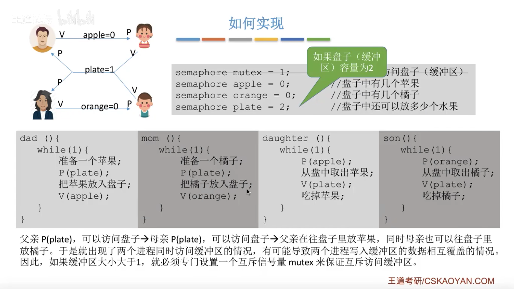
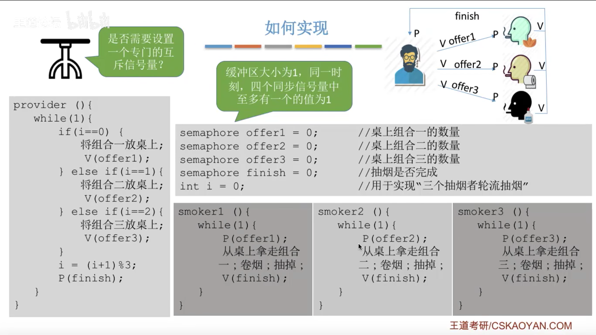
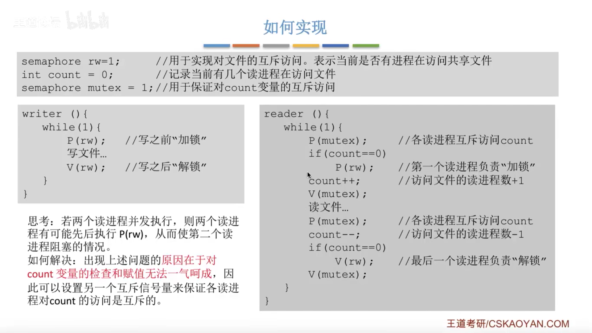
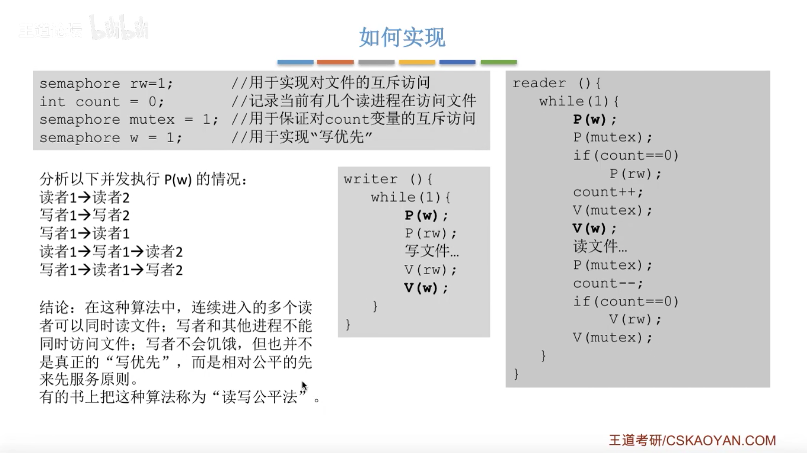
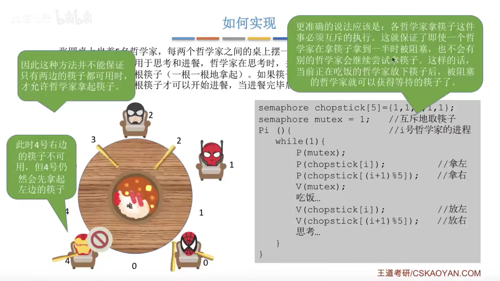

## 教程

[b站](https://www.bilibili.com/video/BV1YE411D7nH?p=24&vd_source=3ec975651088fba288a277c53f0bcc77)

## 知识点

### 进程同步与互斥

生产者--消费者问题

多生产者--多消费者问题

吸烟者问题

读写问题

哲学家进餐问题

## 概念

操作系统特征：并发 共享 虚拟 异步